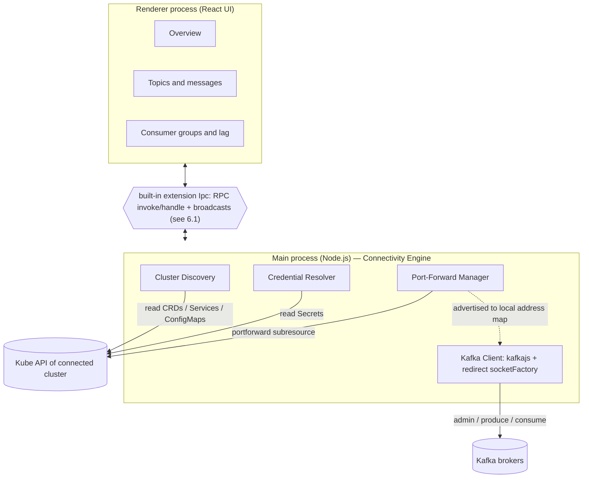
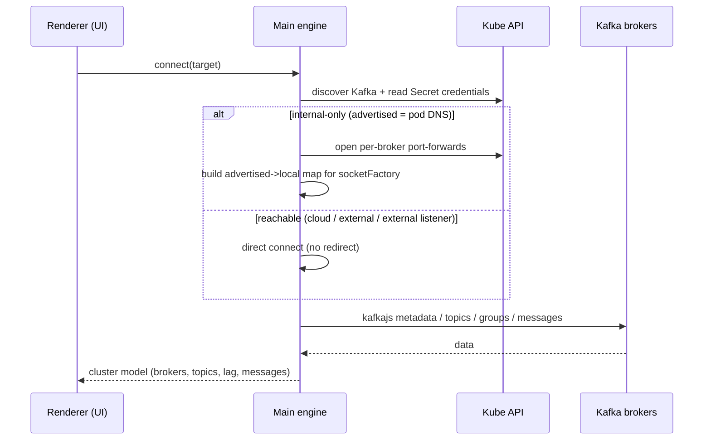

# Freelens Kafka Extension — Architecture

> **Living document.** This is the single source of truth for the extension's
> architecture. Update it on every architectural change (new component, new data
> flow, resolved design decision). Keep all diagrams in Mermaid.

|                           |                                                                                                                                                                                                                                                                  |
| ------------------------- | ---------------------------------------------------------------------------------------------------------------------------------------------------------------------------------------------------------------------------------------------------------------- |
| **Last updated**          | 2026-09-01                                                                                                                                                                                                                                                       |
| **Phase**                 | **SPEC-001–014 Verified. Slices 0–16 and the v1.0.0 implementation sign-off are complete.**                                                                                                                                                                      |
| **Testable in Freelens?** | **Yes — verified on Freelens 1.10.3.** The final production package passed 12/12 base Playwright/Jest scenarios and the three-run authorized browser paint gate, plus all local protocol, security and fallback gates. Install the generated `.tgz` in Freelens. |

---

## 0. Repository layout (P3.0)

Conformant Freelens extension package (matches the other `freelensapp` extensions). Where the earlier phases
say `engine/` or `poc/`, the code now lives here:

- `src/main/` — Main process: `index.ts` (extension) + `ipc.ts` (`Main.Ipc`). `src/main/kafka/` is the **connectivity engine** (former `engine/src`), with colocated `*.test.ts` unit tests.
- `src/renderer/` — Renderer UI: `index.tsx` (cluster page + menu), `kafka-overview.tsx` (Overview page), `kafka-ipc.ts` (`Renderer.Ipc` client). `src/common/` — shared IPC contract + DTOs.
- `test/e2e/` — engine Docker/KinD integration tests + fixtures + `docker-compose.yml` (former `poc/` + `engine/test`), run via `pnpm itest*` / `kind:*`.
- `integration/__tests__/` — Playwright/Jest smoke test copied into the freelens app by the `integration-tests` workflow.
- `.github/workflows/` — the standard set; `docs/` — feature docs; `docs/specs/` — testable SDD contracts and traceability evidence.

### 0.1 Spec-driven development

[`docs/specs/README.md`](./docs/specs/README.md) defines the Discover → Specify → Plan → Implement →
Verify → Evolve lifecycle. User-visible changes start from globally unique `REQ-NNN` requirements,
Given/When/Then scenarios and measurable criteria; a spec becomes `Verified` only after its
requirement→code→test matrix names passing evidence. [`SPEC-001`](./docs/specs/001-loading-usage-navigation.md)
through [`SPEC-013`](./docs/specs/013-ux-performance-v1-gate.md) are all **verified**. See
[`docs/specs/README.md`](./docs/specs/README.md) for the full traceability index.

### 0.2 Verification tiers

1. **Tier 0:** type/lint/unit on every implementation slice.
2. **Tier 1:** optional Playwright MCP exploration against an isolated, allowlisted-context app.
3. **Tier 2:** focused packaged-app Playwright E2E.
4. **Tier 3:** committed integration CI.

Tier 1 accelerates frame-aware inspection, console review, screenshots and selector discovery. It
does not replace Tiers 0, 2 or 3. Every accepted MCP finding is promoted to deterministic test/spec
evidence or recorded as blocked. Runbook: [`docs/playwright-mcp-testing.md`](./docs/playwright-mcp-testing.md).

**Local gates every step:** `type:check`, `lint:check`, `knip:check`, `test:unit` (+ `build`). All green through SPEC-014 Slice 16.
Every library the extension uses at runtime is bundled into `out/` by electron-vite and shipped inside the
package, so they are declared as `devDependencies`; the published manifest intentionally has no runtime
`dependencies`.

---

## 1. Goal & strategic differentiator

A **cluster-native Kafka console** embedded in Freelens. Unlike standalone Kafka
UIs — which are deployed separately and configured by hand — this extension lives **inside a Freelens
session already authenticated to a Kubernetes cluster**, and therefore can:

- **auto-discover** Kafka endpoints (Strimzi `Kafka` CRs, `Service`s on 9092/9093, app env/ConfigMaps);
- **auto-wire credentials** from Kubernetes `Secret`s (SASL/SCRAM, TLS);
- **resolve connectivity transparently** (per-broker port-forward) for clusters reachable only from inside.

It targets **any** Kafka reachable from the connected cluster's workloads —
in-cluster (Strimzi) _and_ external/managed (MSK, Confluent Cloud, Aiven,
Redpanda) — not only Strimzi CRDs.

---

## 2. Current status

| Item                                                                                                                     | State                                                                                                                                   | Location                                                                         |
| ------------------------------------------------------------------------------------------------------------------------ | --------------------------------------------------------------------------------------------------------------------------------------- | -------------------------------------------------------------------------------- |
| Connectivity engine PoC (kafkajs + redirect `socketFactory`)                                                             | **Validated**                                                                                                                           | [`src/main/kafka/`](./src/main/kafka)                                            |
| Reproduction of the internal-only "advertised listener" trap (Docker)                                                    | **Validated**                                                                                                                           | [`test/e2e/docker-compose.yml`](./test/e2e/docker-compose.yml)                   |
| **P1 engine**: Port-Forward Manager + address map + socketFactory + `KafkaConnection`                                    | **Built & validated** (unit + local e2e)                                                                                                | [`src/main/kafka/`](./src/main/kafka)                                            |
| Kube `Forwarder` adapter (`@kubernetes/client-node`)                                                                     | **Validated on kind** (real SPDY port-forward; produce+consume)                                                                         | [`src/main/kafka/kube-forwarder.ts`](./src/main/kafka/kube-forwarder.ts)         |
| **P2 discovery**: Strimzi `Kafka` CR + broker pods, generic Services                                                     | **Built & validated** (unit + kind)                                                                                                     | [`src/main/kafka/discovery.ts`](./src/main/kafka/discovery.ts)                   |
| **P2 credentials**: SASL/SCRAM + TLS/mTLS from Secrets                                                                   | **Built & validated** (unit + kind)                                                                                                     | [`src/main/kafka/credentials.ts`](./src/main/kafka/credentials.ts)               |
| **P2.5 two-phase connect**: metadata → match brokers→pods → per-broker forwards                                          | **Built & validated** (unit + kind e2e)                                                                                                 | [`src/main/kafka/connect-discovered.ts`](./src/main/kafka/connect-discovered.ts) |
| Freelens extension wiring + **CI/workflow conformance** (`.github/workflows`, biome/knip/vitest, integration harness)    | Not started (P3.0)  → **Done**                                                                                                          | —                                                                                |
| **SPEC-001–004 verified**: navigation, stabilization, page migration, settings panel, Clusters/Overview/Topics/Brokers   | **Verified** (100+ unit tests + packaged E2E)                                                                                           | [`SPEC-004`](./docs/specs/004-resource-navigation-cluster-context.md)            |
| **SPEC-005 verified**: Read-only Messages Browse/Tail, byte-safe records, bounded window                                 | **Verified** (80+ unit tests + local protocol + packaged E2E)                                                                           | [`SPEC-005`](./docs/specs/005-read-only-message-browser.md)                      |
| **SPEC-006 verified**: Consumer Groups list, Offsets & Lag, Members, tab workspace                                       | **Verified** (100+ unit tests + local protocol + packaged E2E)                                                                          | [`SPEC-006`](./docs/specs/006-consumer-groups-lag.md)                            |
| **SPEC-007 verified**: Topic/Broker config and bidirectional Topic↔Consumer Group depth                                  | **Verified** (112 unit tests + local protocol + packaged E2E); large-cluster Topic Consumers scan is optimized, bounded and progressive | [`SPEC-007`](./docs/specs/007-topic-broker-depth.md)                             |
| **SPEC-008 verified**: Message filters, timestamp seek and renderer-session-scoped full-window route/filter restoration  | **Verified** (139 unit tests + focused reload E2E + integrated packaged E2E; 11/11 tests)                                               | [`SPEC-008`](./docs/specs/008-message-browser-enhancements.md)                   |
| **SPEC-009 verified**: Per-target write mode, Produce Message and Consumer Group offset reset                            | **Verified** (122 unit tests + local Docker/KinD packaged E2E; 7/7 tests)                                                               | [`SPEC-009`](./docs/specs/009-write-operations.md)                               |
| **SPEC-010 verified**: Schema Registry settings, Subjects, versions, Avro/Protobuf decode and write operations           | **Verified** (133 unit tests + local HTTP Registry packaged E2E; 8/8 tests)                                                             | [`SPEC-010`](./docs/specs/010-schema-registry.md)                                |
| **SPEC-011 verified**: Kafka Connect configuration, list/detail and lifecycle/management writes                          | **Verified** (137 unit tests + local REST packaged E2E; Connect flow passed)                                                            | [`SPEC-011`](./docs/specs/011-kafka-connect.md)                                  |
| **SPEC-012 verified**: ACL inspection gated by a DescribeAcls probe, filtering, and local-safe ACL create/delete         | **Verified** (147 unit tests + authorized local broker packaged E2E; 11/11 tests)                                                       | [`SPEC-012`](./docs/specs/012-acl-security-views.md)                             |
| **SPEC-013 verified**: UX quality gate for navigation, responsive layouts, accessibility and packaged regressions        | **Verified**                                                                                                                            | [`SPEC-013`](./docs/specs/013-ux-performance-v1-gate.md)                         |
| **SPEC-014 verified**: production-scale request batching, bounded persistent workers, honest progress, ETA and freshness | **Verified — Slices 0–16, executable evidence and explicit approval complete**                                                          | [`SPEC-014`](./docs/specs/014-production-scale-performance.md)                   |

**Consequence:** the current artifact is a loadable, packaged Freelens extension with verified
discovery, connectivity, security, UX v3 resource pages, read-only message browsing, consumer group lag inspection and local-safe write operations.
Connection Settings is the only secondary Drawer. All SPEC-001–013 increments are verified with full traceability.
SPEC-013 closes the original UX quality gate. SPEC-014 adds the production-scale performance architecture and extends the v1.0.0 release gate. v2.0.0 covers later stream-query, audit, topology and advanced-management capabilities.

---

## 3. Process model

A Freelens extension has two parts (see the `gateway-api` example):
`Main.LensExtension` (Node.js process) and `Renderer.LensExtension` (React).
Raw TCP and port-forwarding must run in **Main**; the UI lives in **Renderer**.

---

## 4. Components & responsibilities

| Component                | Process         | Responsibility                                                                                                                                                                                                          |
| ------------------------ | --------------- | ----------------------------------------------------------------------------------------------------------------------------------------------------------------------------------------------------------------------- |
| **Cluster Discovery**    | Main            | Find Kafka targets: Strimzi `Kafka`/`KafkaTopic` CRs, `Service`s exposing 9092/9093, bootstrap refs in workload env/ConfigMaps.                                                                                         |
| **Credential Resolver**  | Main            | Extract SASL/SCRAM users, TLS certs/CA from referenced `Secret`s; build kafkajs auth config.                                                                                                                            |
| **Port-Forward Manager** | Main            | Open one port-forward per broker **pod** via `@kubernetes/client-node` (kubeconfig from `Catalog` `kubeConfigPath`/`contextName`); maintain the `advertised → 127.0.0.1:localPort` map; tear down on disconnect.        |
| **Kafka Client**         | Main            | kafkajs admin/producer/consumer. Uses the **redirect `socketFactory`** ([`src/main/kafka/redirect.ts`](./src/main/kafka/redirect.ts)) to dial mapped local endpoints while preserving advertised hostnames for TLS SNI. |
| **Bridge**               | Main ↔ Renderer | Expose engine operations to the UI (see open decision [§6.1](#61-mainrenderer-communication--decided-built-in-extension-ipc)).                                                                                          |
| **UI pages**             | Renderer        | Overview, topic list/detail, message browser, consumer groups + lag. Later: ACLs, Connect, Schema Registry.                                                                                                             |

---

## 5. Connectivity model (the crux)

The make-or-break problem: a Kafka client first reaches a **bootstrap** address,
then reconnects to the brokers' **`advertised.listeners`**. In-cluster those
advertised addresses are internal pod DNS, unreachable from the laptop — so a
single port-forward to the bootstrap is **not** enough.

**Solution (validated):** a kafkajs custom `socketFactory` redirects every
per-broker TCP connection to a reachable local (port-forwarded) endpoint, with
**no Kafka wire-protocol rewriting**.

### Connectivity matrix (effort gradient)

| Scenario                                              | Advertised addresses | Port-forward / redirect needed?              | k8s-aware value                            |
| ----------------------------------------------------- | -------------------- | -------------------------------------------- | ------------------------------------------ |
| Confluent Cloud / Aiven / MSK public / Redpanda Cloud | public               | No                                           | creds-from-Secret + discovery from app env |
| Strimzi / in-cluster with **external** listener       | external, reachable  | No                                           | discovery + creds                          |
| Strimzi / in-cluster, **internal-only**               | pod DNS              | **Yes** (per-broker forward + socketFactory) | maximum (zero-config "magic")              |
| Kafka unrelated to the connected cluster              | n/a                  | n/a                                          | none (plain desktop client)                |

---

## 6. Key design decisions & open questions

### 6.1 main↔renderer communication — DECIDED: built-in extension `Ipc`

**Verified against the API** (`freelens/packages/core/src/extensions/ipc/`). `@freelensapp/extensions`
exposes a first-class, per-extension IPC abstraction:

- `Main.Ipc` (`IpcMain`): `handle(channel, handler)` for request/response RPC; `listen(channel, cb)` for broadcasts.
- `Renderer.Ipc` (`IpcRenderer`): `invoke(channel, ...args): Promise` for RPC; `listen(channel, cb)` for broadcasts.
- Channels are auto-namespaced per extension (`extensions@<id>:<channel>`) and auto-disposed on disable/uninstall.
- It is the same path Freelens core uses to proxy the renderer's K8s calls to main, so it is the idiomatic choice.

**Decision:** the Kafka engine runs in **Main**; the UI talks to it **exclusively through the built-in `Ipc`**:

- **RPC (`invoke`/`handle`)** for: `connect`, `listTopics`, `describeTopic`, `listGroups`, `offsets`/lag, `fetchMessages(page)`.
- **Broadcasts (`listen`)** for live streams: message tail, lag refresh, connection status (main pushes; renderer subscribes with `disposeOnUnmount`).
- A thin **typed contract** in `src/common/` wraps the stringly channels for compile-time safety.
- **`Store.ExtensionStore`** complements it for persistence only (saved connection profiles, UI prefs) — never for live ops.

**Rejected:** a local loopback WS/HTTP server (reinvents `Ipc`, opens a local port = needless attack surface);
running kafkajs in the renderer (couples backend lifetime to the UI, fragile across navigation/reload, against the framework grain).

**Constraints to honor:** keep IPC payloads small — paginate message fetches, throttle the live tail, send message
metadata with lazy body fetch; main owns consumer lifecycle and applies backpressure.

### 6.2 Port-forward — DECIDED: client-side via `@kubernetes/client-node` from the Catalog kubeconfig

**Verified against the API.** Freelens does **not** expose a port-forward helper to extensions
(Main API = `Ipc`, `Catalog`, `K8s` CRUD, `K8sApi`, `Navigation`, `Power`). Core's own port-forward
(`PortForward` spawning the bundled `kubectl --kubeconfig <proxy> port-forward`, in
`main/routes/port-forward/functionality/port-forward.ts`) is internal and not public. **However**,
`Main.Catalog` exposes per-cluster `kubeConfigPath` + `contextName` + `isActive`
(`ClusterInfo` in `extensions/common-api/cluster-types.ts`) — enough to port-forward ourselves.

**Decision:** implement port-forward in **Main** with **`@kubernetes/client-node`'s `PortForward`**,
configured from the active cluster's `kubeConfigPath`/`contextName`. Pure Node (no dependency on a
system/bundled `kubectl`), it yields the local socket to wire directly into the validated `socketFactory`
map, and reuses the kubeconfig the user already selected in Freelens. One forward per broker pod (raw TCP
— the K8s API _service proxy_ is HTTP-only and cannot tunnel the Kafka protocol, so real port-forward is required).

**Fallback:** spawn a system `kubectl port-forward` when a kubeconfig auth method is unsupported by client-node.
**Rejected:** piggybacking Lens's internal port-forward routes/proxy (undocumented, version-unstable).

**Placement default:** client-side per-broker forwards + local redirect (no cluster mutation, minimal RBAC,
ephemeral). Optional advanced mode: opt-in in-cluster proxy for very large broker counts, never silent.

**Honest caveat:** via client-node _we_ handle auth from the raw kubeconfig (tokens, client-certs, exec
plugins) instead of Lens's proxy; rare proxy-only auth setups degrade gracefully with a clear error + the kubectl fallback.

### 6.3 Message deserialization & Schema Registry

JSON/text/binary plus Confluent Avro/Protobuf decoding are implemented through the bounded Schema Registry client; custom serialization remains raw with a non-fatal warning.

### 6.4 Discovery & credentials — DECIDED: `KubeReader` seam over client-node

Discovery/credential reads go through a `KubeReader` seam (`listCustomResources`/`listPods`/`listServices`/`getSecret`),
implemented with `@kubernetes/client-node` from the same kubeconfig as the port-forward. Unit tests inject an in-memory
fake; a fake Strimzi CRD + fixtures validate the real reads on kind. Strimzi discovery reads the `Kafka` CR
(`spec.kafka.listeners` + `status.listeners[].bootstrapServers`, preferring internal plaintext) and broker pods
(`strimzi.io/cluster=<name>`, excluding `broker-role=false`). Generic Service discovery is **precision-tuned**: a port
qualifies only with a Kafka signal (kafka/`tcp-clients` port name, or 9092/9093 on a kafka-named service) — port 9093
alone is ambiguous (Prometheus Alertmanager, caught during kind testing). Credentials come from Secrets: cluster CA
(`<cluster>-cluster-ca-cert`), SCRAM (`KafkaUser` `password`), or mTLS (`user.crt`/`user.key`). The extension (P3) may
back the seam with `Main.K8s` instead.

### 6.5 Advertised-host reconciliation — DONE: two-phase `connectDiscovered`

Discovery yields the bootstrap + broker **pods**, but the exact advertised host each broker announces is authoritative
only from Kafka metadata. `connectDiscovered` (`src/main/kafka/connect-discovered.ts`) is therefore **two-phase**:
(1) port-forward one seed broker pod (redirect-all to the seed) and read metadata → `nodeId → advertised host:port`;
(2) match each broker to its pod — **advertised-host prefix first** (Strimzi per-broker DNS embeds the pod name), else
`nodeId == brokerId` — open a per-broker forward, build the `advertised → local` map, and connect via the exact redirect.
Validated on kind against a broker advertising pod-based DNS (`kafka-0.kafka-brokers…`, unreachable from the host).

### 6.6 CI & repo conformance — DONE (P3.0)

The extension must match the other freelensapp extensions' GitHub workflows: `check` (build:production +
type:check + lint:check + knip:check), `unit-tests` (vitest `test:unit`), `integration-tests` (build+pack the
plugin, build the freelens app at a matrix version, copy `integration/__tests__`, spin a KinD cluster, run
Playwright/Electron), plus trunk-check, osv-scanner, npm-audit/dedupe/version, biome-migrate, release, tag.
**Decision: establish this at the START of P3, before the UI**, so every later step is validated against the same
gates and we avoid a large end-of-project conformance fix. The engine now lives in `src/main/kafka` under the
root tooling; its unit tests are the extension's `test:unit`; the Docker/KinD scripts moved to `test/e2e`.
**Local discipline (run every step):** `type:check`, `lint:check`, `knip:check`, `test:unit`. The packaged
`build`+`pack` and the Playwright/KinD integration run at milestones (impractical every micro-step).

---

## 7. Roadmap

| Phase           | Scope                                                                                                                                                                                                                                                                                               | Status                                |
| --------------- | --------------------------------------------------------------------------------------------------------------------------------------------------------------------------------------------------------------------------------------------------------------------------------------------------- | ------------------------------------- |
| **P0**          | Connectivity engine PoC (kafkajs + redirect socketFactory)                                                                                                                                                                                                                                          | **Done**                              |
| **P1**          | Engine in Main: Port-Forward Manager + dynamic address map, wired to the validated socketFactory                                                                                                                                                                                                    | **Done**                              |
| **P2**          | Cluster Discovery (Strimzi/Service) + Credential Resolver (Secrets)                                                                                                                                                                                                                                 | **Done**                              |
| **P2.5**        | Two-phase connect: metadata-driven advertised-host reconciliation (brokers→pods) + per-broker forwards                                                                                                                                                                                              | **Done**                              |
| **P3.0**        | Repo & CI conformance: scaffold the extension package + fold the engine into `src/main`; replicate the standard `.github/workflows` (check, unit-tests, integration-tests, trunk, osv-scanner, release…) + tooling (biome/prettier/knip/vitest/electron-vite) + Playwright/KinD integration harness | **Done**                              |
| **P3.1**        | Delivered UI increments **(a) Overview, (b) broker drill-in, (c) Topic list/detail**. Original (d) messages and (e) groups are rescheduled after the v3 navigation migration.                                                                                                                       | **(a)(b)(c) Done**                    |
| **P3.2**        | **Universal discovery, reachability & connection (f)–(j)**: non-Strimzi/external discovery, Direct/port-forward strategies, security and manual endpoints. Relay-pod (i) is deferred.                                                                                                               | **Core Done**                         |
| **P3.3**        | **UI/UX overhaul** — Freelens-native sortable/filterable cluster table, reachability/provider/security badges, responsive desktop/compact layout and consistent loading/empty/error states. Its original detail Drawer was later retired by P3.4.                                                   | **Done**                              |
| **P3.4**        | **UX v3 resource navigation and Kafka cluster context (SPEC-004):** sidebar pages, stable selection, Clusters, Overview, Brokers, Topics/Topic Workspace and primary Drawer retirement.                                                                                                             | **Verified**                          |
| **P3.5**        | **Read-only message browser (SPEC-005):** bounded Browse, explicit Tail and selected-message inspector without offset commits.                                                                                                                                                                      | **Verified**                          |
| **P3.6**        | **Consumer Groups and lag (SPEC-006):** group list, offsets/lag, members/topics detail and Topic cross-links.                                                                                                                                                                                       | **Verified**                          |
| **P4 / v1.0.0** | Topic and Broker depth (SPEC-007), Message browser enhancements (SPEC-008), Write policy + Produce + offset reset (SPEC-009), Schema Registry (SPEC-010), Kafka Connect (SPEC-011), ACL views (SPEC-012), UX quality gate (SPEC-013), production-scale performance (SPEC-014).                      | **Complete — SPEC-001–014 Verified.** |
| **v2.0.0**      | Features beyond v1.0.0 scope: KsqlDB, audit log, Kafka Streams topology, advanced management, broker config write, relay pod, MSK IAM/OAUTHBEARER.                                                                                                                                                  | Unscheduled                           |

### P4 / SPEC-014 completion roadmap

Detailed requirements, tasks and evidence remain authoritative in
[`SPEC-014`](./docs/specs/014-production-scale-performance.md).

| Slice    | Outcome                                                                                                                                                                                  | Status                                               |
| -------- | ---------------------------------------------------------------------------------------------------------------------------------------------------------------------------------------- | ---------------------------------------------------- |
| **0–10** | Baseline through initial production-scale gate: explicit discovery, bounded sessions, progressive pages, local scale tests, packaged app and first authorized read-only comparison.      | **Complete**                                         |
| **11**   | Freeze aggregate-health protocol request evidence and introduce typed batching seams.                                                                                                    | **Complete**                                         |
| **12**   | Batch OffsetFetch and ListOffsets while preserving complete fallback semantics.                                                                                                          | **Complete**                                         |
| **13**   | Bound memory, cancellation, deadlines, session reuse and idle cleanup.                                                                                                                   | **Complete**                                         |
| **14**   | Add the persistent, cancellable aggregate-health worker, exact/lower-bound coverage and sanitized persisted snapshots.                                                                   | **Complete**                                         |
| **15**   | Report honest phase-local progress and ETA; add compact Health status, independent freshness labels and packaged visual/accessibility regressions (completed 2026-08-25).                | **Complete**                                         |
| **16**   | Run the full release gate, three authorized read-only MSK measurements, pinned open-source reference-console API/browser comparison, compatibility-fallback equality and final sign-off. | **Verified — explicit approval received 2026-09-01** |

### P3.1 increments

Each increment is gated by the local checks (`type:check`, `lint:check`, `knip:check`, `build`, `test:unit`) and updates this doc plus the relevant `docs/*.md`.

- **(a) Overview — Done.** Cluster page lists the discovered Strimzi Kafka clusters via the `discover` IPC (Main auto-resolves the active cluster). Renderer: [`kafka-overview.tsx`](./src/renderer/kafka-overview.tsx) + [`kafka-ipc.ts`](./src/renderer/kafka-ipc.ts). Doc: [`docs/overview-ui.md`](./docs/overview-ui.md).
- **(b) Cluster drill-in / brokers — Done.** Opening Overview invokes the `overview` handler (two-phase connect → per-broker forward → `kafkajs` metadata) and renders brokers (id / host / port), the controller and topic count. Added the `ClusterOverviewDto` + `KafkaIpcRenderer.overview()`; no new Main handler. Doc: [`docs/overview-ui.md`](./docs/overview-ui.md).
- **(c) Topics list & detail — Done (SPEC-003).** Existing overview supplies lightweight names; topic-scoped `kafka:topic` lazily calls `fetchTopicMetadata`, returning partition leader/replicas/ISR/offline/health. Native searchable list + keyboard detail is verified through MCP, protocol and packaged/committed E2E.
- **(d) Message browser — Done (SPEC-005).** Bounded Browse with lazy message fetching per page + explicit Tail session with throttling. UI: key/value/headers/timestamp/offset inspector with no automatic read or offset commit. Fully verified via protocol evidence and packaged E2E.
- **(e) Consumer Groups & lag — Done (SPEC-006).** Group list with sortable/filterable table, per-group workspace with Offsets & Lag and Members tabs. Lag computation using BigInt to handle large offsets correctly. Fully verified via protocol evidence and packaged E2E.

### P3.2 increments — universal discovery & reachability

Extends discovery beyond Strimzi to **any** Kafka the connected cluster's workloads use, and
lets the user see/choose how each is reachable — from the PC's network (VPN / public) vs only
from the cluster's pods. This realises the §1 "any Kafka" goal for external/managed clusters.

> **Execution order (evolved).** Breadth first delivered **(f) → (g) → (h)** and one shared
> `resolveConnection` strategy before Topic depth (c). Manual endpoints (j core) and P3.3 were pulled
> forward after user testing. Manual review then exposed the Drawer-first navigation limit, so
> accepted **P3.4 / SPEC-004** now precedes message depth (P3.5) and Consumer Groups (P3.6). Relay (i)
> remains P4 because it requires Kubernetes writes and a separate safety/RBAC decision.

- **(f) Universal discovery — Done (verified on Freelens 1.10.3).** Wires `discoverKafkaServices`
  (in-cluster non-Strimzi `Service`s) and adds **workload-config discovery**: `discoverWorkloadKafkas`
  scans `Deployment`/`StatefulSet`/`DaemonSet` container env + `envFrom` (`ConfigMap`/`Secret`) for
  bootstrap keys (`KAFKA_BOOTSTRAP_SERVERS`, `bootstrap.servers`, `spring.kafka.bootstrap-servers`, …)
  and classifies each endpoint (`classifyProvider`: MSK `*.kafka.*.amazonaws.com`, Confluent
  `*.confluent.cloud`, Aiven, Redpanda, Upstash → external; `.svc`/bare names → in-cluster).
  `discoverAllKafkas` merges all three sources and de-dups in-cluster overlaps (a Strimzi cluster's
  own `Service`s, or a workload pointing at an already-listed bootstrap). The `KubeReader` seam grew
  `listWorkloads`/`getConfigMap` (both list **cluster-wide** via `Main.K8s`), and the Overview gained
  a **Source** column (Strimzi / In-cluster / `MSK · external` / …). PC-reachable non-Strimzi rows
  can open Overview via Direct (g). _Verified:_ a kind cluster with pods referencing MSK (via env **and**
  `envFrom` ConfigMap) plus a non-Strimzi `redpanda` `Service` surfaced both rows in real Freelens,
  with no Strimzi CR installed.
- **(g) Reachability + Direct connect — Done (verified on Freelens 1.10.3).** A `reachability` IPC
  TCP-probes each bootstrap's first broker from Main ([`reachability.ts`](./src/main/kafka/reachability.ts),
  read-only — connect then destroy), and the Overview shows **From PC ✓/✗** + **From pods ✓/✗** per
  cluster. `chooseStrategy(source, pcReachable)` ([`src/common/reachability.ts`](./src/common/reachability.ts))
  picks `portForward` (Strimzi), `direct` (PC-reachable — kafkajs straight to the bootstrap, no
  port-forward, e.g. MSK over VPN) or `relay` (pod-only, not yet available). A single
  `resolveConnection(request)` in [`ipc.ts`](./src/main/ipc.ts) applies the strategy, and
  `KafkaConnection` gained a **direct mode** (`connectDirect`) whose sockets are tracked and
  force-closed on `disconnect()` (a leaked direct socket otherwise keeps the Electron main process
  alive). Non-Strimzi rows can open Overview once PC-reachable. _Verified:_ a workload referencing an
  external, host-reachable broker showed **From PC ✓** and Overview Direct-connected to it
  (`Controller · Brokers`) with no port-forward, and the app exits cleanly (~13s, vs a 120s hang before
  the socket-leak fix).
- **(h) External connection & credentials — Done (verified on Freelens 1.10.3).**
  `createWorkloadEnvironmentResolver` resolves the exact container that references the selected
  bootstrap; `resolveExternalCredentials` recognizes PLAINTEXT/TLS, SASL/PLAIN (including Confluent
  API key/secret aliases), SCRAM-SHA-256/512, Spring JAAS configs and inline PEM CA/client cert/key
  from env, `valueFrom`, `envFrom`, ConfigMaps and Secrets. Secret values remain Main-only; Renderer
  receives only `KafkaSecurityHint` / effective `KafkaSecuritySummary`.
  - **Automatic:** discovery labels the non-secret security mode; opening Overview re-resolves credentials
    Main-side and passes them to `connectDirect`.
  - **Override:** the secondary Connection Settings panel offers TLS Auto/On/Off and auth Auto/None/PLAIN/SCRAM. Passwords
    live only in renderer memory for the current session/request and are never persisted.
  - **Evidence:** a disposable local Kafka passed real metadata reads over PLAINTEXT no-auth,
    TLS no-auth, SASL/PLAIN, SCRAM-SHA-256 and SCRAM-SHA-512; a kind workload + Secret auto-connected
    with PLAIN, then the UI reconnected with a live SCRAM-256 override. An explicitly authorized
    read-only environment remained green: five managed targets discovered, four VPN-reachable, 3
    brokers and 906–982 topics read; no environment identifier is retained in the repository.
  - **Deferred:** MSK IAM/OAUTHBEARER and credentials available only as files inside a container
    (reading those would require pod exec) remain later work. Inline PEM/mounted Secret values exposed
    as env are supported; no pod exec is used.
- **(j) Manual endpoint — Core done (verified on Freelens 1.10.3).** **Add endpoint** accepts a
  comma-separated bootstrap plus TLS on/off, stores it in renderer `localStorage`, probes From-PC
  reachability and adds it to the same sortable/filterable table. Reachable endpoints open Overview via
  Direct and can be removed from Connection Settings. From-pods is deliberately **Unknown** because no
  Kubernetes workload references a manual endpoint. TLS/SASL overrides use the same panel via (h).
- **(i) Relay-pod strategy (advanced).** For external Kafka reachable **only** from the pods
  (e.g. MSK on a private subnet, no VPN): deploy a short-lived in-cluster TCP relay pod and
  port-forward to it. Heaviest (pod-create RBAC, cleanup, security) — may move to P4.

### P3.3 — UI/UX overhaul — Done

- **Cluster list:** `Renderer.Component.Table`, sticky sortable headers, global search (name /
  namespace / bootstrap / referenced workload), reachability segmented filter, stable responsive
  columns and ellipsis/tooltips for multi-broker bootstrap strings.
- **Status:** native `Badge` + `Icon` for source, effective TLS/auth, From-PC and From-pods (including truthful
  `Unknown` for manual endpoints); native `Spinner`, styled empty/error/no-match states.
- **Secondary settings:** native resizable `Renderer.Component.Drawer` with bootstrap, connection
  strategy, reachability, session-only security override, explicit reconnect and manual removal.
- **Responsive:** desktop and compact layouts explicitly constrain stable columns; Playwright asserts
  no page/table/Drawer horizontal overflow.
- **Meaningful progress (SPEC-001):** correlated Main→Renderer events report real discovery phases
  (cluster/resources/workloads/merge with `x/y` workloads) and detail phases
  (security/connection/brokers/topics); percentages are monotonic weighted phase completion, not
  time estimates. Completion remains visible briefly without delaying results.
- **Usage/navigation (SPEC-001):** workload targets show aggregate workload + namespace counts;
  Strimzi/Service targets show resource namespace; manual targets show no Kubernetes ownership.
  Inspectable rows open Overview from any cell or Enter/Space; the named `tune` action opens only
  Connection Settings and remains available for unreachable manual endpoints.
- **Runtime CSS:** Freelens's external-extension loader only `require()`s `renderer.js`; it does not
  attach emitted CSS assets. The SCSS is therefore imported with `?inline` and injected once as
  `#freelens-kafka-extension-styles`, making the tarball self-contained. The committed integration
  test asserts this style element exists.

### P3.4 — UX v3 resource navigation — Verified

Contract: [`SPEC-004`](./docs/specs/004-resource-navigation-cluster-context.md), based on the accepted
[`Kafka UX v3`](./docs/design/kafka-ux-v3-proposal.md).

1. **Kafka cluster context — Done:** derive a stable non-secret `targetId`, persist explicit selection
  per active Kubernetes cluster and provide pure stale/ambiguous selection resolution.
2. **Freelens navigation — Done:** Apache Kafka `hub` parent and functional Clusters, Overview,
  Topics and Brokers children use typed URL state and a shared page shell/selector. Further children
  are registered only when functional.
3. **Resource pages — Clusters/Overview/Brokers/Topics done:** discovery/manual endpoint parity,
  truthful summaries and SPEC-003 Topic Workspace are packaged-app verified. Topic detail uses
  URL-backed state on `kafka-topics` so its owning sidebar item remains active.
4. **Selector semantics:** switching cluster keeps a resource list, while switching from Topic
   Workspace returns to Topics for the new cluster. Secrets never enter route params.
5. **Stabilization — Done:** duplicate sibling tabs are removed (6A); shared metric plus
  Topics/Partitions table geometry passes Linux packaged and Windows visual evidence (6B); a
  renderer-owned 60-second discovery/reachability/overview cache provides in-flight deduplication,
  generation-safe invalidation, visible age/state and packaged plus authorized read-only timing
  evidence (6C).
6. **Drawer retirement — Done:** the primary resource Drawer, duplicate loaders and resource tabs
  are removed; only context-isolated, session-only Connection Settings remains as a secondary panel.
7. **No dead navigation:** Consumer Groups, Schema Registry, Kafka Connect and Produce Message are
   not registered until their own functionality and acceptance gates exist.
8. **Verification:** unit/static, Docker metadata, KinD discovery/port-forward, isolated MCP,
   packaged Freelens 1.10.3 and committed integration tiers.

### P3.5 — Read-only message browser — Implementing SPEC-005

- **Browse — Done:** explicit partition, earliest/latest-window/offset/timestamp and limit `1..100`;
  group-free `READ_COMMITTED` broker Fetch, byte-safe inspector and packaged desktop/compact evidence.
- Explicit bounded Tail with start/stop lifecycle; entering the page performs no read.
- Split list/inspector for key, value, headers, timestamp, partition and offset, with truthful
  JSON/text/binary rendering.
- No group join, offset commit or Kafka write. Automated evidence uses disposable local Kafka only.
- Accepted [`SPEC-005`](./docs/specs/005-read-only-message-browser.md) owns `REQ-055`–`REQ-073`;
  Tail remains the next implementation slice.

### P3.6 — Consumer Groups and lag — Planned SPEC-006

- Cluster-level group list with state, members, topics and aggregate lag.
- Group Workspace tabs for Offsets & Lag, Members and Topics.
- End-offset comparison without offset mutation; Topic/Group cross-links preserve cluster context.
- Consumer Groups becomes visible in the sidebar only when the page is functional.
- Requirement IDs are allocated only when SPEC-006 is accepted.

### P4 — Advanced and approval-gated work — Unscheduled

- **Produce Message:** dedicated compose/review/send page, disabled by default, explicit write-enabled
  cluster allowlist and separate user approval. Automated writes remain local-only.
- **Resource domains:** Schema Registry, Kafka Connect and ACL/security views, each introduced only
  with a functional page and separate specification.
- **Connectivity/auth:** relay-pod strategy, MSK IAM/OAUTHBEARER and credentials available only in
  mounted files; each requires a focused security and operational design.
- **Optional depth:** Broker Workspace for leadership/configuration only if the data justifies a full
  entity workflow.

---

## 8. References

- **Connectivity engine**: [`src/main/kafka/`](./src/main/kafka) — `redirect.ts`, `port-forward-manager.ts`, `kube-forwarder.ts`, `kafka-connection.ts`, `connect-discovered.ts`
- **Discovery & credentials**: [`src/main/kafka/discovery.ts`](./src/main/kafka/discovery.ts), [`src/main/kafka/credentials.ts`](./src/main/kafka/credentials.ts), [`src/main/kafka/external-credentials.ts`](./src/main/kafka/external-credentials.ts), [`src/main/kafka/workload-environment.ts`](./src/main/kafka/workload-environment.ts), [`src/main/kafka/kube-reader.ts`](./src/main/kafka/kube-reader.ts)
- **Feature docs**: [`docs/connectivity-engine.md`](./docs/connectivity-engine.md), [`docs/discovery.md`](./docs/discovery.md), [`docs/overview-ui.md`](./docs/overview-ui.md), [`docs/message-browser.md`](./docs/message-browser.md)
- **Accepted UX and current contract**: [`docs/design/kafka-ux-v3-proposal.md`](./docs/design/kafka-ux-v3-proposal.md), [`docs/specs/005-read-only-message-browser.md`](./docs/specs/005-read-only-message-browser.md)
- **Engine integration tests**: [`test/e2e/`](./test/e2e) (`pnpm kafka:up`, `pnpm itest`, `pnpm kind:*`)
- **Extension wiring**: [`src/main/index.ts`](./src/main/index.ts), [`src/main/ipc.ts`](./src/main/ipc.ts), [`src/renderer/index.tsx`](./src/renderer/index.tsx), [`src/renderer/kafka-overview.tsx`](./src/renderer/kafka-overview.tsx), [`src/renderer/kafka-ipc.ts`](./src/renderer/kafka-ipc.ts), [`src/common/ipc.ts`](./src/common/ipc.ts)
- Structural template: `../freelens-gateway-api-extension`
