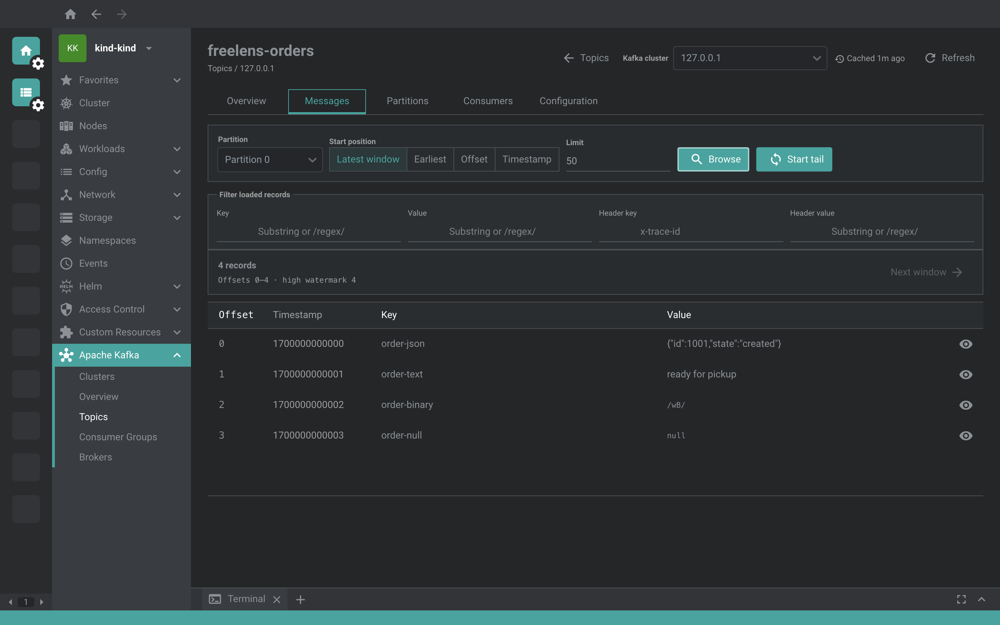

# @freelensapp/kafka-extension

<!-- markdownlint-disable MD013 -->

[](https://freelens.app)
[](https://github.com/freelensapp/freelens-kafka-extension)
[](https://deepwiki.com/freelensapp/freelens-kafka-extension)
[](https://github.com/freelensapp/freelens-kafka-extension/releases)
[](https://github.com/freelensapp/freelens-kafka-extension/actions/workflows/unit-tests.yaml)
[](https://github.com/freelensapp/freelens-kafka-extension/actions/workflows/integration-tests.yaml)
[](https://www.npmjs.com/package/@freelensapp/kafka-extension)

<!-- markdownlint-enable MD013 -->

## Overview

[Freelens](https://freelens.app) extension for **Apache Kafka**: discover the
Kafka clusters running in, or used by, your Kubernetes cluster and inspect
them without leaving Freelens and without manual `kubectl port-forward`
gymnastics.

The extension is a cluster-native Kafka console. It lives inside a Freelens
session that is already authenticated to a Kubernetes cluster, so it can
auto-discover Kafka endpoints (Strimzi `Kafka` resources, Services exposing
Kafka ports, and external or managed Kafka such as Amazon MSK, Confluent
Cloud, Aiven or Redpanda referenced by the cluster's own workloads), auto-wire
credentials from Kubernetes Secrets, and reach brokers that are routable only
from inside the cluster through per-broker port-forwards. Everything lives in
the cluster sidebar under **Apache Kafka**: **Clusters**, **Overview**,
**Topics**, **Consumer Groups**, **Brokers** and, once an endpoint is
configured, **Schema Registry**, **Kafka Connect** and **ACLs**.



The goal is feature parity with the standalone open-source Kafka consoles,
embedded in the tool you already use for the cluster. The extension is a
from-scratch MIT implementation: it does not reuse code or UI from any of
them.

### Status

> **SPEC-001–014 verified; v1.0.0 implementation sign-off complete.** The
> extension discovers Strimzi, generic in-cluster and workload-referenced
> external/managed Kafka (including MSK), probes PC reachability, connects via
> port-forward or Direct and reads broker/controller/topic metadata. The native
> Freelens UI is sortable/filterable, uses dedicated
> Clusters/Overview/Topics/Brokers/ConsumerGroups pages, supports manual
> endpoints and resolves TLS/no-auth, PLAIN, SCRAM and mTLS profiles from
> workload Secrets or session-only overrides. Its Topics view searches names and
> lazy-loads partition leadership, replicas, ISR/offline replicas and health.
> [SPEC-004](./docs/specs/004-resource-navigation-cluster-context.md) verifies
> stable target identity, **Clusters**, **Overview**, **Topics**, Topic
> Workspace, **Brokers**, shared caching and a secondary Connection Settings
> panel. The former primary resource Drawer is retired.
> [SPEC-005](./docs/specs/005-read-only-message-browser.md) delivers explicit
> bounded read-only **Messages Browse** and **Tail**.
> [SPEC-006](./docs/specs/006-consumer-groups-lag.md) adds **Consumer Groups**
> list and **Offsets & Lag** workspace.
> [SPEC-007](./docs/specs/007-topic-broker-depth.md) adds topic/broker
> configuration and bidirectional Topic/Consumer Group cross-links.
> [SPEC-008](./docs/specs/008-message-browser-enhancements.md) adds URL-backed
> message filters, timestamp seek and full-window reload restoration.
> [SPEC-009](./docs/specs/009-write-operations.md) adds the local-safe Produce
> and Consumer Group offset-reset workflow.
> [SPEC-010](./docs/specs/010-schema-registry.md) adds Schema Registry subjects,
> versions and Avro/Protobuf decoding.
> [SPEC-011](./docs/specs/011-kafka-connect.md) adds Kafka Connect connector
> list, detail and lifecycle. [SPEC-012](./docs/specs/012-acl-security-views.md)
> adds ACL inspection, filtering and local-safe ACL create/delete on brokers
> that authorize it. SPEC-001–014 are verified with full test traceability.
> SPEC-014 meets its three-run packaged click-to-paint SLO and pinned
> open-source reference-console browser comparison. See
> [ARCHITECTURE.md](./ARCHITECTURE.md) and the [spec
> index](./docs/specs/README.md).

Slow Kubernetes/MSK operations expose real graphical phases: discovery shows
resource checks and `x/y` workload scanning; detail shows security, connection,
broker and topic metadata. Workload targets show aggregate Kubernetes usage
rather than an arbitrary first namespace, and a reachable row opens from any
cell or the keyboard.

## Requirements

- **Freelens >= 1.8.0.** Verified on Freelens 1.10.3, the version the
  integration tests run against.
- **Kubernetes access** through the kubeconfig context Freelens uses for the
  cluster. Discovery reads Strimzi custom resources, Services, Pods, Secrets
  and ConfigMaps; port-forwards use the same credentials.
- **Apache Kafka.** The test fixtures run Apache Kafka 3.9 (KRaft). Brokers
  are reached with the [kafkajs](https://kafka.js.org/) client over
  plaintext or TLS, with no authentication, SASL/PLAIN, SASL/SCRAM or mTLS.
  OAUTHBEARER and AWS IAM authentication are not supported yet.
- **Node.js** is required only when building the extension from source; it
  is not needed to run it. The package is a self-contained bundle: its
  runtime libraries (`kafkajs`, `@kubernetes/client-node`) are compiled into
  `out/`, so Freelens loads it without installing anything extra (Freelens
  does not npm-install an extension's dependencies).

## Supported sources

| Source | Found through | Reached through |
| --- | --- | --- |
| Strimzi `Kafka` resources | CRs and broker pods | Per-broker port-forward |
| In-cluster Services | Services on the Kafka ports | Port-forward or Direct |
| External or managed Kafka | Workload env and config | Direct, when reachable |
| Manual endpoints | **Add endpoint** on Clusters | Direct, TLS optional |

Strimzi clusters are reached through the pod-DNS advertised listeners of
their broker pods; in-cluster Services are found best effort on the Kafka
ports; external or managed Kafka (Amazon MSK, Confluent Cloud, Aiven,
Redpanda, ...) is found in the bootstrap servers the workloads reference and
reached directly from your machine over a VPN or a public endpoint.

Credentials come from the cluster or from the session: SASL/SCRAM and
TLS/mTLS material from Strimzi `KafkaUser` Secrets, PLAIN, SCRAM and TLS
settings from the Secrets the workloads themselves reference, or session-only
overrides in the Connection Settings panel. Passwords are never persisted.

## Installation

Install the extension from the Freelens **Extensions** page
(`ctrl`+`shift`+`E` or `cmd`+`shift`+`E`) by npm name:

```text
@freelensapp/kafka-extension
```

Alternatively, download the `.tgz` from the
[GitHub releases](https://github.com/freelensapp/freelens-kafka-extension/releases)
page and drag it into the Freelens window, or provide its path on the
Extensions page.

You can also build and pack the extension yourself, see
[Build from the source](#build-from-the-source).

## Getting started

1. Connect to a cluster. An **Apache Kafka** group with **Clusters**,
   **Overview**, **Topics**, **Consumer Groups** and **Brokers** children
   appears in the cluster's left sidebar.
2. Open **Clusters**. It lists Strimzi, Kafka Services and external/managed
   endpoints referenced by workload config. Reachable external Kafka use
   Direct; Strimzi uses per-broker port-forward. **Add endpoint** connects to
   a bootstrap not referenced by Kubernetes (TLS optional).
3. Click or press Enter on a reachable row to open its full **Overview**
   page. Use the row's `tune` action for session-only Connection Settings or
   manual endpoint removal.
4. Open **Topics**, filter by name and select one to inspect partition
   topology and replica health. Open **Messages** inside Topic Workspace; no
   records are read until **Browse** is pressed.
5. No Kafka at hand? A few commands give you something to look at, see
   [Local fixtures](#local-fixtures-kind-and-docker).

> **Safety:** discovery, reachability, port-forward and metadata/topic reads
> are read-only. Never produce messages, alter topics/configs/ACLs, commit
> offsets or mutate Kubernetes resources on a real cluster. See
> [TESTING-SAFETY.md](./TESTING-SAFETY.md).

## Features

### Discovery and connectivity

Explicit scanning with visible progress (resource checks, then `x/y` workload
scanning), reachability probing from your machine, and one shared connection
strategy: Direct when the bootstrap is reachable, otherwise a two-phase
connect that reads the metadata, matches brokers to pods and opens one
port-forward per broker. Sessions are bounded and reused across pages, and
resource snapshots are served stale-while-revalidate, so ordinary navigation
never repeats discovery, credential resolution or connection setup.

### Clusters, Overview and Brokers

The **Clusters** table shows every discovered target with its source, its
reachability and aggregate Kubernetes usage. **Overview** shows the security
profile, the connection strategy, brokers, the controller and topic metadata.
**Brokers** lists the brokers with their configuration.

### Topics

A searchable topic list that lazy-loads partition leadership, replicas,
in-sync and offline replicas and health, plus a Topic Workspace with a
Configuration tab and cross-links to the consumer groups reading the topic.

### Messages

Bounded, read-only **Browse** and **Tail** inside the Topic Workspace, with a
byte-safe inspector for key, value, headers, timestamp and offset. Nothing is
read until you press Browse, no consumer group is created and no offset is
ever committed. Filters on key, value and headers, seek by timestamp, and
URL-backed state that survives a reload of the window. Avro and Protobuf
payloads are decoded when a Schema Registry endpoint is configured.

### Consumer groups

A sortable and filterable group list and a per-group workspace with
**Offsets & Lag** (computed with BigInt, so large offsets stay exact) and
**Members**, with cross-links back to the topics. Aggregate health across
groups is computed by a persistent, cancellable background worker with
batched offset requests and explicit exact or lower-bound coverage.

### Schema Registry, Kafka Connect and ACLs

Optional per-cluster endpoints (URL, TLS flag and optional basic auth, stored
in the extension settings without secrets) add the **Schema Registry** page
(subjects and versions), the **Kafka Connect** page (connector list, detail
and lifecycle) and the **ACLs** page (list and filtering) to the sidebar only
for the clusters that have them.

### Write operations

Writes are disabled by default. A session-only write mode per target unlocks
Produce Message, consumer group offset reset, Schema Registry and Kafka
Connect management, and ACL create/delete on brokers that authorize it, each
behind an explicit confirmation. Automated tests only ever write to the local
`kind` cluster and the disposable Docker fixtures.

### Production-scale performance

Phase-local progress with a confidence-gated ETA, a compact background Health
status with independent freshness labels, bounded lists and caches, and warm
or persisted snapshots that stay usable during background refresh and
failure. The packaged app meets a click-to-paint SLO measured over three
authorized read-only runs; the evidence is in
[docs/performance](./docs/performance/).

## Limits

- Authentication covers TLS, SASL/PLAIN, SASL/SCRAM and mTLS. OAUTHBEARER,
  AWS IAM for MSK, and credentials available only as files inside a
  container are not supported yet.
- Brokers that are reachable only from inside the cluster are reached
  through port-forwards to their pods; there is no relay pod, so a cluster
  without port-forwardable broker pods needs a reachable endpoint.
- On the discovery-only local fixtures the Kafka pods are not real brokers,
  so opening Overview fails to connect; Connection Settings stays available.

## Development

The repository is developed spec-first, with the specs in the repository:

- [ARCHITECTURE.md](./ARCHITECTURE.md) — design, decisions, roadmap.
- [Spec index](./docs/specs/README.md) — globally unique requirements,
  lifecycle and verification status, one spec per feature in
  [docs/specs/](./docs/specs/).
- [SPEC-COMPLETION-WORKFLOW.md](./docs/SPEC-COMPLETION-WORKFLOW.md) — how a
  spec goes from accepted to verified.
- [TESTING-SAFETY.md](./TESTING-SAFETY.md) — the non-negotiable rules for
  autonomous testing against real clusters.
- [docs/connectivity-engine.md](./docs/connectivity-engine.md) — how the
  redirecting socket factory + port-forward manager reach in-cluster brokers.
- [docs/discovery.md](./docs/discovery.md) — Strimzi / Service discovery +
  credentials.
- [docs/overview-ui.md](./docs/overview-ui.md) — the renderer overview +
  drill-in UI and its IPC flow.
- [docs/message-browser.md](./docs/message-browser.md) — group-free bounded
  record Fetch and byte-safe inspector.
- [Kafka UX v3](./docs/design/kafka-ux-v3-proposal.md) — accepted
  page/navigation design and complete delivery sequence.
- [SPEC-004](./docs/specs/004-resource-navigation-cluster-context.md) —
  verified contract for resource pages and selected Kafka cluster context.
- [CHANGELOG.md](./CHANGELOG.md) — what each release adds and changes.

### Local gates

Node 24.15.0 (`.nvmrc` / `mise.toml`) + `corepack pnpm`. Run the local gates
after every change:

```sh
corepack pnpm type:check
corepack pnpm lint:check     # biome  (lint:fix to auto-format)
corepack pnpm build
corepack pnpm knip:check
corepack pnpm test:unit
```

Engine integration tests run against Docker / KinD, see
[test/e2e](./test/e2e) and the `kafka:*` / `kind:*` / `itest*` scripts in
[package.json](./package.json).

### Demo environment (Docker + kind)

`demo:up` builds a disposable, fully populated environment on your machine,
so that anyone can try the extension or record a demo without preparing
anything by hand. It needs only Docker, kind and Node.js: kubectl is used
when present, otherwise the kubectl inside the kind node does the work.

```sh
corepack pnpm demo:up      # or: npm run demo:up
corepack pnpm demo:status
corepack pnpm demo:down    # deletes the demo cluster and the Docker broker
```

What you get:

- A dedicated kind cluster `freelens-kafka-demo` (context
  `kind-freelens-kafka-demo`, added to your kubeconfig). Your own `kind`
  cluster is never touched.
- A real single-broker Kafka 3.9 inside the cluster, discovered as the
  Strimzi cluster `orders` in namespace `kafka-demo` and reached through a
  port-forward.
- A second broker in Docker on `127.0.0.1:19093`, referenced by the
  `checkout-service` workload in the cluster, discovered as an external
  Kafka and reached directly.
- On both brokers: the topics `orders` (6 partitions), `payments`,
  `shipments` and `notifications` with JSON records, keys and headers; the
  consumer group `billing-service`, kept active by a running consumer; the
  consumer group `orders-dashboard`, stopped early so its lag keeps growing;
  a producer that writes one order per second to `orders`, so Tail always
  has something to show.

In Freelens open the `kind-freelens-kafka-demo` cluster, then **Kafka** in
the sidebar. The first run pulls the kind node and Kafka images, so allow a
few minutes; later runs take about a minute. Environment variables:
`DEMO_DIRECT=0` skips the Docker broker, `DEMO_DIRECT_PORT` changes its
port, `DEMO_PRODUCE_INTERVAL_SECONDS` changes the producer rate,
`DEMO_CLUSTER` renames the kind cluster and `DEMO_KIND_NODE_IMAGE` pins the
kind node image.

On Windows run the scripts from WSL2, with either Docker Engine installed
in the distribution or Docker Desktop's WSL integration. Since Freelens runs
on Windows, `demo:up` also writes a copy of the kubeconfig to
`%USERPROFILE%\.kube\freelens-kafka-demo.yaml` and prints its path: add
that file to Freelens (Preferences, Kubernetes, sync a kubeconfig file);
`demo:down` removes it. The API server and the Docker broker listen on
`127.0.0.1` inside WSL and reach Windows through WSL2's localhost
forwarding, which is on by default.

### Local fixtures (kind and Docker)

- **Discovery only** (populate the Overview table, no real brokers): deploy
  the Strimzi CRD and sample `Kafka` fixtures used by the tests:

  ```sh
  corepack pnpm kind:disc:up     # apply fake Strimzi CRD + Kafka CRs
  # ... test in Freelens ...
  corepack pnpm kind:disc:down   # tear down
  ```

  The Clusters table will list the fixtures. Opening Overview will fail to
  connect because the fixture pods are not real brokers; Connection Settings
  remains available independently.

- **Fastest Overview + Topics test** uses a disposable host-reachable Kafka
  and a zero-impact workload reference in `kind-kind`:

  ```sh
  # starts Kafka and creates freelens-orders (3 partitions)
  corepack pnpm kafka:direct:up
  # makes the bootstrap discoverable from kind-kind
  corepack pnpm kind:direct:up
  # Open kind-kind → Kafka → 127.0.0.1 → Topics → freelens-orders
  corepack pnpm kind:direct:down
  corepack pnpm kafka:direct:down
  ```

  Overview shows the Direct connection, broker metadata and the searchable
  topic/partition detail. For the internal-only port-forward path, install a
  real Strimzi Kafka in KinD and open its pod-DNS-advertised listener.

### Assisted UI verification with Playwright MCP

For fast frame-aware exploratory UI verification, start an isolated Freelens
CDP session containing only `kind-kind`:

```sh
corepack pnpm mcp:app
```

Then attach a locally configured, version-pinned Playwright MCP server. This
is an optional assisted loop; focused and committed integration tests remain
mandatory. See [Playwright MCP testing](./docs/playwright-mcp-testing.md) and
[ADR-001](./docs/decisions/001-playwright-mcp-assisted-verification.md).

## Build from the source

You can build the extension from this repository.

### Prerequisites

Use [NVM](https://github.com/nvm-sh/nvm),
[mise-en-place](https://mise.jdx.dev/), or
[windows-nvm](https://github.com/coreybutler/nvm-windows) to install the
required Node.js version.

From the root of this repository:

```sh
nvm install
# or
mise install
# or
winget install CoreyButler.NVMforWindows
nvm install 24.15.0
nvm use 24.15.0
```

Install pnpm:

```sh
corepack install
# or
curl -fsSL https://get.pnpm.io/install.sh | sh -
# or
winget install pnpm.pnpm
```

### Build extension

```sh
pnpm i
pnpm build
pnpm pack
```

One script to build and pack the extension for testing:

```sh
pnpm pack:dev
```

This bumps a throwaway prerelease version, builds, and writes a
`freelensapp-kafka-extension-*.tgz` into the repo root. The version bump
makes Freelens treat each rebuild as an upgrade, so re-installing actually
reloads your changes.

### Install built extension

The tarball will be placed in the current directory. In Freelens, navigate
to the Extensions page (`ctrl`+`shift`+`E` or `cmd`+`shift`+`E`) and provide
the path to the tarball, or drag and drop the `.tgz` file into the Freelens
window. Enable it if prompted.

### Check code statically

```sh
pnpm lint:check
```

or

```sh
pnpm trunk:check
```

and

```sh
pnpm build
pnpm knip:check
```

### Testing the extension with unpublished Freelens

In the Freelens working repository:

```sh
rm -f *.tgz
pnpm i
pnpm build
pnpm pack -r
```

Then in the extension repository:

```sh
echo "overrides:" >> pnpm-workspace.yaml
for i in ../freelens/*.tgz; do
  name=$(tar zxOf $i package/package.json | yq -r .name)
  echo "  \"$name\": $i" >> pnpm-workspace.yaml
done

pnpm clean:node_modules
pnpm build
```

## License

Copyright (c) 2025-2026 Freelens Authors.

[MIT License](https://opensource.org/licenses/MIT)
