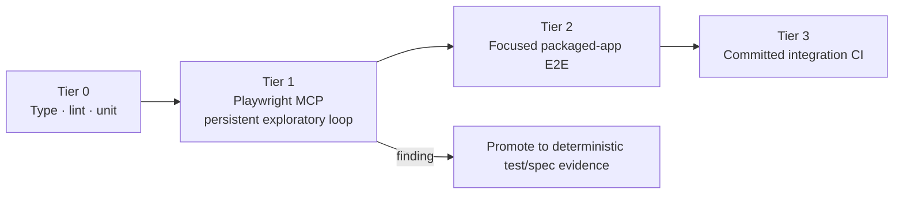

# ADR-001 — Adopt Playwright MCP as an Assisted Verification Layer

| Field | Value |
| --- | --- |
| Status | Accepted |
| Date | 2026-07-22 |
| Related | [SPEC-002](../specs/002-playwright-mcp-assisted-verification.md), [Freelens PR #2272](https://github.com/freelensapp/freelens/pull/2272) |

## Context

Freelens renders the shell in the top page and each connected Kubernetes cluster in a cross-origin
iframe. UI development therefore needs frame-aware inspection, console evidence, screenshots and fast
iteration against a running Electron app. The existing Jest/Playwright packaged-app suite provides
isolated, deterministic regression coverage, but repeatedly launches and installs the extension. It
also occasionally spends 120 seconds in the Freelens extension installer before a test begins.

Freelens PR #2272 established an agent-driven Playwright MCP pattern against the dev CDP endpoint. It
explicitly describes this as the manual/agent counterpart to existing integration tests and promotes
coverage gaps into deterministic tests.

A local pilot against Freelens 1.10.3 demonstrated:

- CDP attach in **44 ms**;
- navigation from `/welcome` to the catalog;
- exact selection of `kind-kind`;
- access to cross-origin `#cluster-frame-*`, with sidebar visible and two Playwright frames;
- Electron remained alive after the Playwright client disconnected.

The pilot also exposed the main risk: without isolation, the catalog showed **37 kube contexts**,
including production-looking entries. Playwright MCP is not a security boundary.

## Decision

Adopt Playwright MCP as **Tier 1: assisted exploratory verification**, between static/unit gates and
focused packaged-app E2E. Keep the existing Playwright/Jest integration suite as the required local and
CI regression gate.

### Intended use

- Rapidly inspect the running app and cluster iframe after a UI edit.
- Discover stable selectors and frame boundaries.
- Inspect accessibility snapshots, console warnings/errors, responsive layouts and screenshots.
- Exercise exploratory scenarios not yet worth encoding while a spec is being refined.
- Reuse a persistent Electron process to avoid repeated app startup for every exploratory observation.

### Non-use

- Not a CI gate.
- Not proof of regression safety by itself.
- Not a replacement for unit, integration or packaged-app E2E.
- Not a mechanism for Kafka/Kubernetes writes.
- Not a reason to keep an unrepeatable agent-only assertion.

## Guardrails

1. Start Freelens with [`scripts/start-playwright-mcp-app.sh`](../../scripts/start-playwright-mcp-app.sh),
  which builds a one-context kubeconfig and pre-seeds Freelens's `syncKubeconfigEntries` preference.
  Changing `HOME`/`KUBECONFIG` alone is insufficient in Freelens 1.10.3.
2. Default and autonomous target is exactly `kind-kind`.
3. A real target requires the user to name it and `ALLOW_REAL_READ_ONLY=1`; all existing
   [`TESTING-SAFETY.md`](../../TESTING-SAFETY.md) read-only restrictions remain in force.
4. Select cluster rows by exact allowlisted text/id. Generic “first cluster” or broad regex selection
   is forbidden.
5. Do not enable unrestricted file access, storage/network/devtools/vision capabilities by default.
6. Do not export storage state, Secret values, request bodies or credentials into MCP artifacts.
7. Keep MCP configuration local and version-pinned; do not commit `.mcp.json`.
8. Every defect/finding must end as one of: fixed + deterministic test, explicit spec evidence, or
   documented blocked/non-reproducible result.
9. Keep temporary kubeconfig/app data private and let the detached launcher watchdog remove it after
  normal or forced termination; retention requires explicit `FREELENS_MCP_RUNTIME_DIR` opt-in.

## Consequences

### Positive

- Faster feedback for visual and Electron runtime issues.
- Rich, frame-aware inspection matching the real Freelens architecture.
- Better selector/test design before committing an E2E.
- Persistent app context is useful for multi-step exploratory loops.

### Negative

- Agent-driven runs are stateful and less reproducible than test code.
- Accessibility snapshots and MCP schemas consume more context/tokens; upstream recommends CLI +
  Skills for high-throughput coding-agent work.
- CDP exposes the full running app; isolation is mandatory.
- A launcher pilot proved that environment-only isolation still exposed 37 host contexts because
  Freelens 1.10.3 defaults kubeconfig sync from `os.userInfo().homedir/.kube`.
- Extension code changes still require rebuild/repack/reinstall or a dev-loader workflow.

## Alternatives Considered

- **Only existing Jest/Playwright:** deterministic but slower for exploratory diagnosis and selector
  discovery.
- **Replace E2E with MCP:** rejected; loses CI repeatability and clean-state guarantees.
- **Playwright CLI + Skills only:** potentially more token-efficient; revisit after the MCP workflow
  produces enough repeated steps to justify a dedicated Skill. MCP is currently preferred for its
  persistent state and rich iterative introspection.
- **Commit shared MCP configuration:** rejected because CDP endpoint, package execution policy and
  cluster exposure are developer-local security decisions.

## Review Trigger

Review after five UI iterations or three months. Measure attach/setup time, number of findings
promoted to tests, false positives, token cost and any safety/flake incident. Migrate repeatable flows
to CLI + Skill if it is materially more efficient.
