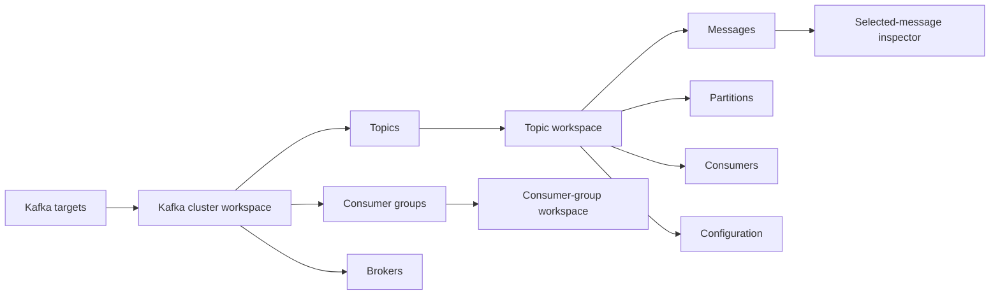

# Kafka UX v2 — Navigation and Workspace Proposal

| Field | Value |
| --- | --- |
| Status | Superseded by [`Kafka UX v3`](./kafka-ux-v3-proposal.md) |
| Date | 2026-07-24 |
| Source | Manual-test feedback after SPEC-003 |
| Mockup | [`../mockups/kafka-navigation-v2.html`](../mockups/kafka-navigation-v2.html) |
| Safety | Read-only Kafka/Kubernetes behavior remains mandatory |

This document is retained as design history. Its roadmap is not active; the accepted v3 proposal and
SPEC-004 are authoritative.

## Problem

The current implementation places cluster connection data, brokers, the topic list and topic
partition detail inside one resizable Drawer. This is acceptable for quick inspection but does not
scale to a developer workflow that will add message browsing, consumer-group lag, schemas and other
Kafka capabilities. It weakens orientation, constrains table width and makes primary resources feel
secondary.

## Research Conclusions

### Freelens patterns to adopt

- One extension can register multiple independent `clusterPages`; Sveltos already registers Overview,
  Clusters and Profiles and composes menu hierarchy with `parentId`.
- An extension can navigate to its own hidden pages with `LensRendererExtension.navigate(pageId,
  params)`. Registered `PageParam`s serialize state into the URL, enabling reload and browser
  back/forward.
- `Renderer.Component.Tabs`, `Tab`, `Table`, `Select`, `MonacoEditor`, `VirtualList` and resizable
  Drawer are public extension components in Freelens 1.10.3.
- Drawers are appropriate for secondary inspection while full list/detail workflows use pages.
- The cluster frame already supplies Kubernetes-cluster context; the Kafka target remains an explicit
  page parameter and IPC input.

### Kafka-console patterns to adopt

Common open-source Kafka consoles converge on:

1. cluster overview;
2. dedicated topic list;
3. dedicated topic workspace with Messages, Partitions, Consumers and Configuration;
4. dedicated consumer-group list and detail;
5. URL-backed filters and navigation;
6. message list plus focused value/header inspector.

Useful ideas:

- Redpanda: separate `/topics` and `/topics/:topic`, URL-backed list state, lazy expensive tabs,
  breadcrumb navigation and split message inspection.
- One common pattern: explicit cluster context, resource list/detail routes, cross-links between topics and
  consumer groups.
- Another common pattern: partition/offset/start-position controls, explicit Browse versus Live Tail, pagination tokens.

Patterns to avoid:

- a permanent sidebar branch per Kafka target;
- putting every resource and action into one page or Drawer;
- eagerly fetching every expensive dataset when a page opens;
- dense configuration/action surfaces in the read-only default path;
- implicit message reads, unbounded tails or offset commits.

## Proposed Information Architecture

Only one static Freelens sidebar entry remains: **Kafka**.

### 1. Kafka Targets Page

Purpose: discovery, reachability and target selection.

- Full-width native table: target, Kubernetes usage, source, bootstrap, security and reachability.
- Search and restrained segmented reachability filter.
- Add endpoint and Refresh remain page actions.
- Row click/Enter navigates to the Kafka Cluster Workspace.
- No topic or broker data is rendered here.

### 2. Kafka Cluster Workspace

Purpose: work inside one selected Kafka target.

Header:

- Back to Kafka targets;
- target name, provider, connection status and bootstrap;
- Connection settings and Refresh actions;
- compact metric strip.

Contextual tabs:

- **Overview** — connection/security strategy, controller, Kubernetes usage and references;
- **Topics** — searchable full-page topic table;
- **Consumer Groups** — group state and lag list;
- **Brokers** — broker/controller/rack/health table.

The target is represented by a stable, non-secret `targetId`. Credentials never appear in the URL.
On reload the extension re-discovers and resolves the target ID; within one session it reuses the
already-loaded target registry.

### 3. Topic Workspace

Purpose: understand and debug one topic.

Header:

- Back to `<target> / Topics`;
- topic name, internal/application type and health;
- partition and replication summary.

Contextual tabs:

- **Overview** — summary and health;
- **Messages** — bounded read-only browse/tail workflow;
- **Partitions** — leader, replicas, ISR, offline replicas and watermarks;
- **Consumers** — consumer groups using the topic;
- **Configuration** — read-only grouped effective configuration when implemented.

The default tab is Overview. Entering a topic MUST NOT start consuming messages.

### 4. Consumer Group Workspace

Purpose: diagnose group activity and lag.

- Cluster-level list: state, members, topics, total lag and coordinator.
- Detail tabs: Offsets & Lag, Members, Topics.
- Topic names link to the Topic Workspace.
- No delete, reset or offset-commit operations.

### 5. Message Inspector

Messages are the one place where a secondary panel is useful.

- Message table remains visible while inspecting key, headers, metadata and value.
- Desktop: right-side split inspector.
- Compact: inspector stacks below the message list.
- Browse controls: partition, newest/oldest/timestamp/offset and bounded limit.
- Tail is an explicit mode with Stop, bounded buffer and visible dropped-message count.
- Main never joins a consumer group and never commits offsets.

## Route Model

Proposed registrations, all inside the active Freelens cluster frame:

| Page ID | Parameters | Visible in sidebar |
| --- | --- | --- |
| `kafka` | list filters/sort | Yes |
| `kafka-cluster` | `target`, `view` | No |
| `kafka-topic` | `target`, `topic`, `view` | No |
| `kafka-group` | `target`, `group`, `view` | No |

Navigation uses the extension's own `navigate(pageId, params)` API. Page parameters are registered
with parse/stringify functions and become URL query parameters. Browser back/forward and page reload
therefore preserve context without a custom router.

## Visual Direction

- Quiet operational interface, consistent with Freelens rather than a standalone marketing UI.
- Full-width unframed page sections; no nested cards.
- Native tables, tabs, selects, badges and icon buttons.
- Compact 76 px page header, 40 px contextual tabs, 36–40 px table rows.
- Restrained neutral palette with semantic green/amber/red and one teal accent.
- Monospace only for bootstrap addresses, offsets, keys and payloads.
- Stable dimensions and column priorities at 1440, 1024 and 760 px.
- Peripheral columns hide before primary data; message inspector stacks on compact layouts.

## Data and Performance Strategy

- Target list remains the lightweight discovery entry point.
- Cluster Overview reuses existing metadata and security resolution.
- Topics first return names. Summary metadata is requested only for the visible/paginated topic set;
  full partition arrays remain topic-scoped.
- Topic configuration, consumers and messages load only when their tab is selected.
- Message reads are bounded by partition/range/limit and cancellable.
- A selected target registry avoids repeated discovery during in-app navigation; reload still resolves
  the target safely from fresh discovery.
- Errors are scoped to the current page/tab and do not destroy navigation context.

## Drawer Policy

After this redesign, a Drawer is NOT used for:

- Kafka cluster workspace;
- topic list;
- topic partition table;
- consumer-group list/detail;
- message browser.

A Drawer or split inspector remains appropriate for:

- selected-message inspection;
- connection/security settings;
- optional quick target diagnostics that do not replace navigation.

## Proposed Roadmap

### UX2.1 — Route and Layout Foundation

- Author SPEC-004 starting at `REQ-033`.
- Add stable `targetId`, target registry and typed page params.
- Register Kafka Targets, Cluster, Topic and Group pages.
- Add shared page header, back navigation, metric strip and contextual tabs.
- Preserve all existing behavior while old Drawer remains temporarily reachable.

**Gate:** URL reload/back/forward, target isolation, no credentials in URL, unit/static and packaged E2E.

### UX2.2 — Cluster Workspace Migration

- Move generic cluster metadata and connection settings to Overview.
- Move Brokers to the Brokers view.
- Move Topic list to the Topics view.
- Remove cluster/topic primary workflows from the existing Drawer.

**Gate:** current SPEC-001 and SPEC-003 behavior passes in its new location; MCP desktop/compact review.

### UX2.3 — Topic Workspace Migration

- Move partition topology and health to Topic Overview/Partitions.
- Add topic-list summary loading for visible rows.
- Add URL-backed topic/view state and explicit empty/error/not-found states.

**Gate:** pointer/keyboard navigation, direct URL, back to filtered topic list, no overflow.

### UX2.4 — Read-Only Message Browser

- Author the next behavior spec after navigation is stable.
- Add bounded Main-owned fetch sessions without consumer groups or commits.
- Implement Browse, then explicit bounded Tail.
- Add table and selected-message inspector shown in the mockup.

**Gate:** protocol fixture, cancellation/cleanup tests, MCP UI evidence and packaged/committed E2E.

### UX2.5 — Consumer Groups and Lag

- Add group list and group workspace.
- Add offsets/end-offset comparison and lag summaries.
- Cross-link group topics to Topic Workspace.

**Gate:** all operations read-only; no offset reset/commit APIs.

### UX2.6 — Consolidation

- Remove obsolete Drawer code and duplicate state.
- Verify 1440/1024/760 layouts, keyboard paths, loading/error states and console output.
- Refresh README, architecture, SDD traceability and screenshots.

## Acceptance Criteria for the Redesign

- Primary Kafka resources never depend on a Drawer for normal navigation.
- The current target and resource are always visible in the page header.
- Back/forward/reload preserve target, resource and tab without persisting credentials.
- No page automatically reads messages.
- Every potentially long operation is cancellable or bounded and has a truthful state.
- Tables and inspectors have no incoherent overlap or horizontal page overflow at supported widths.
- Keyboard navigation covers targets, tabs, topics, messages and groups.
- All existing discovery/security/direct/port-forward/manual-endpoint regressions remain green.
- Playwright MCP is used for iterative accessibility/screenshot review; deterministic E2E remains the gate.

## Approval Requested

Recommended approval scope:

1. accept the four-page information architecture;
2. accept one static Kafka sidebar entry plus contextual page tabs;
3. accept removing Topics/Partitions from the cluster Drawer;
4. accept message selection as a split inspector rather than another full page;
5. authorize UX2.1–UX2.3 before resuming the message-browser engine work.

No runtime implementation should begin until this proposal is approved or revised.
