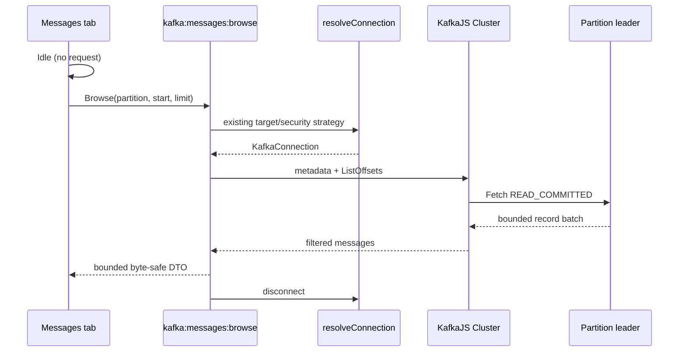

# Read-Only Message Browser

SPEC-005 adds Messages inside one Topic Workspace. Browse is delivered; explicit bounded Tail is the
next slice. Opening Messages performs no record read.

## Safe protocol path

KafkaJS's public consumer requires a `groupId`, so Browse does not use it. The pinned KafkaJS 2.2.4
adapter in [`message-fetch.ts`](../src/main/kafka/message-fetch.ts):

1. creates an internal Cluster with `READ_COMMITTED` and `allowAutoTopicCreation=false`;
2. resolves topic/partition metadata and earliest/latest/timestamp through ListOffsets;
3. sends one leader-specific Fetch for one partition with a 1 MiB broker-response target;
4. uses KafkaJS Batch to remove pre-request offsets, aborted transactions and control records;
5. returns at most 100 records and 512 KiB of aggregate preview bytes;
6. disconnects the internal cluster and the outer Direct/port-forward connection in `finally`.

KafkaJS 2.2.4 recognizes LZ4 attributes but does not include a codec. Browse registers the bundled
`lz4-asm` ASM build directly in `CompressionCodecs`; it emits no external `.wasm` file and works in
Node 24/Electron/Windows. The higher-level `kafkajs-lz4` package is intentionally not used because
its default WASM loader cannot resolve a local asset in this runtime.

No runtime Browse code constructs a consumer, joins a coordinator, commits an offset, produces a
record, enables auto topic creation or invokes a mutating admin API.



## Browse semantics

- **Earliest:** starts at the partition log-start offset.
- **Latest window:** starts at `max(logStart, highWatermark - limit)` and returns ascending available
  records; compacted logs may return fewer records than the offset-window size.
- **Offset:** accepts a non-negative decimal offset inside `[logStart, highWatermark]`.
- **Timestamp:** resolves the first offset at or after the epoch-millisecond timestamp; a timestamp
  beyond the log returns an empty completed window at the high watermark.
- **Next window:** starts explicitly from the prior `nextOffset`; there is no automatic pagination.

## Byte representation

Each key, value and ordered header value reports format, original byte length and truncation. Kafka
null remains null. Full valid UTF-8 is rendered as text; valid JSON is pretty-printed only when its
preview is complete. Invalid UTF-8 is never replacement-decoded and is shown as base64. Binary and
truncated fields retain exact bounded preview bytes as base64.

Message DTOs and results remain Renderer memory only. They do not enter URLs, localStorage, shared
resource cache or logs.

## Verification

```sh
pnpm test:unit src/main/kafka/message-fetch.test.ts
pnpm kafka:direct:up
pnpm itest:messages
pnpm kafka:direct:down
```

The local protocol fixture writes only to disposable Docker Kafka. It verifies JSON/text/binary/null,
duplicate headers, an actual LZ4 batch, offset/timestamp/latest windows and unchanged consumer-group count. Packaged
Freelens tests additionally verify Idle request count zero, explicit Next, keyboard inspection and
desktop/760×700 layout, including non-overlapping readable start-mode segments with no scrollable
overflow (preventing Windows native scrollbars from covering their lower border). The selected state
keeps the segment flat while focus is rendered on the surrounding fieldset. No real cluster is
required or written. The partition picker remains fully interactive; its local 150 px field overrides
Freelens's global 220 px Select minimum so it cannot overlap Start position.
