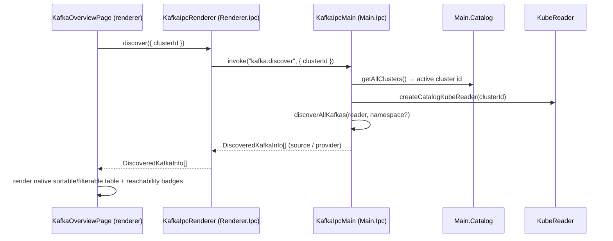

# Overview UI (P3.1 + P3.3)

The cluster **Overview** lists every Kafka discovered from Strimzi CRs, Services and workload
configuration, plus user-added manual endpoints. It probes reachability, selects port-forward or
Direct, and routes read-only metadata into dedicated Overview, Topics and Brokers pages. The
Clusters row's `tune` action opens a secondary Connection Settings panel only.

## Data flow



### Resource-page metadata

Clicking or pressing Enter/Space on a reachable row opens Overview and invokes `overview`, whose `resolveConnection` selects Strimzi
port-forward or Direct, then returns a `ClusterOverviewDto` (brokers, controller, topics).

```mermaid
sequenceDiagram
    participant Page as KafkaOverviewPage
    participant Ipc as KafkaIpcRenderer
    participant Main as KafkaIpcMain
    participant Eng as connectDiscovered (engine)

    Page->>Ipc: overview({ namespace, clusterName })
    Ipc->>Main: invoke("kafka:overview", req)
    Main->>Main: resolveConnection(source, bootstrap)
    Main->>Eng: port-forward (Strimzi) OR Direct (PC/VPN-reachable)
    Eng-->>Main: KafkaConnection
    Main->>Main: connection.overview() then disconnect()
    Main-->>Ipc: ClusterOverviewDto
    Ipc-->>Page: ClusterOverviewDto
    Page->>Page: render Overview; Topics/Brokers reuse the bounded snapshot
```

  Selecting a topic invokes `topic` with the same target/security request. Main reconnects through the
  same strategy and calls `fetchTopicMetadata({ topics: [name] })`; only that topic's partition topology
  crosses IPC, then all sockets/forwards are closed in `finally`.

## Pieces

| File                                                                                        | Role                                                                                                                                         |
| ------------------------------------------------------------------------------------------- | -------------------------------------------------------------------------------------------------------------------------------------------- |
| [`src/common/ipc.ts`](../src/common/ipc.ts)                                                 | Shared `discover` / `overview` / `topic` / `reachability` channels, requests and cluster/topic DTOs.                                         |
| [`src/main/ipc.ts`](../src/main/ipc.ts)                                                     | Discovery, reachability and connection-resolving overview/topic handlers with correlated progress and guaranteed teardown.                   |
| [`src/main/kafka/topic-metadata.ts`](../src/main/kafka/topic-metadata.ts)                   | Pure KafkaJS metadata normalization and partition-health summaries.                                                                          |
| [`src/renderer/kafka-ipc.ts`](../src/renderer/kafka-ipc.ts)                                 | Typed Renderer IPC wrappers for discovery, overview, topic and reachability.                                                                 |
| [`src/renderer/index.tsx`](../src/renderer/index.tsx)                                       | Binds active-cluster-aware callbacks to the page.                                                                                            |
| [`src/renderer/kafka-resource-cache.ts`](../src/renderer/kafka-resource-cache.ts)           | Renderer-owned 60-second discovery/reachability/overview cache with in-flight deduplication, generation guards and aggregate request counts. |
| [`src/renderer/kafka-connection-settings.ts`](../src/renderer/kafka-connection-settings.ts) | Context/target-isolated, session-only TLS/auth credential overrides.                                                                         |
| [`src/renderer/kafka-overview.tsx`](../src/renderer/kafka-overview.tsx)                     | Native Clusters list, manual endpoints and settings-only secondary Drawer.                                                                   |
| [`src/renderer/kafka-resource-pages.tsx`](../src/renderer/kafka-resource-pages.tsx)         | Shared Overview/Brokers target loader, selector, cache state and page rendering.                                                             |
| [`src/renderer/kafka-topic-pages.tsx`](../src/renderer/kafka-topic-pages.tsx)               | Topics list and URL-backed Topic Workspace with partition detail.                                                                            |
| [`src/renderer/kafka-overview.scss`](../src/renderer/kafka-overview.scss)                   | Responsive page tables, badges, states and Connection Settings; bundled with `?inline`.                                                      |

## Active-cluster resolution

The renderer sends the active cluster's `clusterId` (`Renderer.Catalog.getActiveCluster()?.id`)
but never kubeconfig details. Main reads through the connected cluster with
`createCatalogKubeReader(clusterId ?? activeClusterId())` (`Main.K8s`), and — only for metadata
port-forward — resolves the kubeconfig **context** via `clusterContext()` from
`Main.Catalog.getAllClusters()` (the entry matching `clusterId`, else `isActive`, else the first).
This keeps the renderer decoupled from cluster wiring.

## States

- **Loading** — while the `discover` promise is pending.
- **Progress** — a native graphical bar shows real phases and their purpose. Discovery reports
  cluster/resource checks, `completed/total` workload scanning and merge; detail reports
  security resolution, connection, broker metadata and topic metadata. Percentages are monotonic
  phase weights, not time estimates; the 100% state remains visible briefly alongside results.
- **Error** — the handler threw (e.g. RBAC denied listing the Strimzi CRs); the message is shown.
- **Empty** — no Kafka found from any source (Strimzi CRs, Services, workload config).
- **Table** — native sortable rows with search + All/From-PC/Pod-only filter, source/security/
  reachability badges and responsive columns. `Kubernetes usage` means workload + unique namespace
  counts for workload-discovered targets; for Strimzi/Service it is the resource namespace; manual
  endpoints are explicitly not Kubernetes-owned. Rows with an available connection strategy open
  Overview from any cell or Enter/Space.
- **Manual endpoint** — Add endpoint accepts bootstrap + initial TLS, persists only the non-secret
  endpoint, probes it and uses Direct when reachable. From-pods is Unknown.
- **Resource pages** — Overview shows connection identity and truthful metadata; Brokers shows
  advertised broker identity; Topics and Topic Workspace own search, partition/leader/replica/ISR/
  offline and health data. No resource depends on a Drawer.
- **Connection Settings** — a named `tune` command opens a secondary panel with TLS Auto/On/Off and
  Auto/None/PLAIN/SCRAM plus session-only username/password overrides. Opening performs no network
  request; Apply explicitly reconnects. Unreachable manual endpoints can still be removed.
- **Cache state** — cluster-scoped pages show `Loading`, `Refreshing`, `Updated … ago` or
  `Cached … ago`. Overview, Topics and Brokers reuse bounded non-secret snapshots; explicit Refresh,
  target/context changes, manual endpoint mutations and Connection Settings invalidate applicable
  entries.

## Connection model

Reads (discovery, credentials, reachability) run from Main. Discovery goes through Freelens's
connected cluster via `Main.K8s.queryCluster` / `getResource` (no raw kubeconfig). After discovery
the page calls the `reachability` IPC, which **TCP-probes** each bootstrap's first broker from Main
(read-only — connect then destroy) and fills the **From PC** column.

Opening Overview or explicitly reconnecting Settings picks a connection strategy
(`chooseStrategy(source, pcReachable)`):

- **port-forward** — Strimzi (brokers are pods): loads the standard kubeconfig
  (`~/.kube/config` / `$KUBECONFIG`) and selects the cluster's context (the catalog's `kubeConfigPath`
  points at the Freelens proxy, which cannot tunnel a port-forward), then tunnels each broker.
- **direct** — a bootstrap reachable from this machine (public / VPN, e.g. MSK): `kafkajs` connects
  straight to the bootstrap, no port-forward. Its sockets are tracked and force-closed on disconnect
  (a leaked direct socket otherwise keeps the Electron main process alive).
- **relay** — reachable only from the cluster's pods: not available yet (P3.2 i); the row cannot open
  Overview, but Connection Settings remains available.

Overview and Brokers show broker identity/controller/topic metadata; Topic Workspace lazy-loads
partition topology. Automatic external credentials stay Main-side. The renderer-owned settings store
contains only volatile overrides keyed by Kubernetes cluster and non-secret `targetId`; cache DTOs,
URLs and localStorage never contain passwords. [`SPEC-004`](./specs/004-resource-navigation-cluster-context.md)
verifies the complete page migration and primary Drawer retirement. Read-only messages and Consumer
Groups follow as separate roadmap specifications.

## Validation

Covered by the standard local gates (`type:check`, `lint:check`, `knip:check`,
`build`, `test:unit`). The native UI is **verified end-to-end on Freelens 1.10.3** by Playwright:
style injection, Add/remove endpoint, TCP reachability, page-based metadata, settings-only Drawer,
keyboard form/row behavior, topic search/lazy partition detail, real phase progression and
desktop/compact overflow checks. The committed integration test protects this contract in CI. See
[`SPEC-001`](./specs/001-loading-usage-navigation.md) and
[`SPEC-003`](./specs/003-topic-list-detail.md) for delivered requirement traceability.
[`SPEC-004`](./specs/004-resource-navigation-cluster-context.md) is Verified with packaged
Clusters/Overview/Topics/Brokers, cache and Drawer-retirement evidence.

Cache evidence is covered by seven focused unit tests, packaged exact request-count assertions and the
hard-gated `pnpm itest:cache:real` aggregate read-only probe. The latter requires the exact authorized
context and never emits endpoint, credential, Secret or topic-name values.

> **External CSS gotcha.** Freelens 1.10.3 loads an external extension by `require(renderer.js)` and
> does not load Vite's separate CSS output. `kafka-overview.scss?inline` is injected idempotently as
> `#freelens-kafka-extension-styles`; emitting only `kafka-extension.css` leaves the UI unstyled.

KinD fixtures:

- `pnpm kind:disc:up` / `kind:disc:down` — Strimzi CR + pause pods: discovery **list** only.
- `pnpm kind:univ:up` / `kind:univ:down` — non-Strimzi/external fixture (workload `env` + `envFrom` ConfigMap → MSK, plus a `redpanda` Service): universal-discovery **list**.
- `pnpm kind:real:up` / `kind:real:down` — a real single-broker `apache/kafka` (Strimzi-style,
  pod-DNS advertised) so Overview connects and lists the broker.
- `pnpm kafka:direct:up` / `kafka:direct:down` + `pnpm kind:direct:up` / `kind:direct:down` — a
  host-reachable broker + a workload referencing it: verifies the **reachability probe** + **Direct**
  connect (no port-forward).
- `pnpm kafka:auth:up && pnpm itest:security` — disposable local broker verifies actual PLAINTEXT,
  TLS-no-auth, PLAIN and SCRAM-256/512 metadata reads; `kind:auth:up` adds a Secret-backed workload
  for automatic PLAIN + live SCRAM override UI E2E.

To try the **UI inside Freelens** manually: build + pack the extension and drag the `.tgz`
into the Freelens window — see the [README](../README.md) "Try it in Freelens" section.

> **Runtime contract (gotcha).** `Renderer.Ipc` / `Main.Ipc` extend Lens's `Singleton`, so
> they must be created with `KafkaIpcRenderer.createInstance(this)` /
> `KafkaIpcMain.createInstance(this)` — **never** `new`, which throws
> _"A singleton class must be created by createInstance()"_ on first render. Static gates
> (`type:check` / `lint` / `knip` / unit) cannot catch this because unit tests never load
> the real `@freelensapp/extensions` runtime; only loading the extension in Freelens does.
> The Playwright integration test (`integration/__tests__/extensions.tests.ts`) now opens
> the Kafka cluster page in a real cluster frame and asserts `.KafkaOverviewPage` renders,
> so this class of regression is caught in CI.
