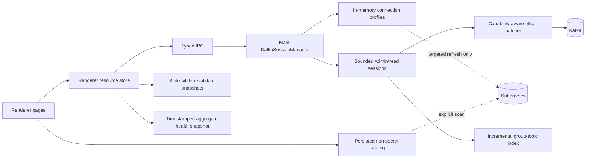

# SPEC-014 - Production-Scale Performance and Responsive Loading

| Field | Value |
| --- | --- |
| Status | Verified |
| Date | 2026-08-20 |
| Updated | 2026-09-01 |
| Source | Additional v1.0.0 scope accepted by the user after production-scale comparison with AKHQ |
| Safety | Read-only performance work; governed by `TESTING-SAFETY.md` |

## Problem

SPEC-001-013 deliver the planned feature set, but the current loading architecture does not scale
to real clusters with hundreds or thousands of topics and consumer groups. The extension repeatedly
performs Kubernetes discovery, credential resolution, Kafka connection setup and global Kafka
queries during normal navigation. The UI frequently waits for complete datasets before rendering.

On a large, explicitly authorized read-only Kafka target, normal page navigation can therefore take
tens of seconds even though the Kafka query needed by the destination page is comparatively fast.
AKHQ feels substantially faster because it keeps cluster clients alive, reuses server-side data,
paginates large collections and separates initial list rendering from enrichment work.

SPEC-014 changes the loading architecture so that:

- opening Kafka does not imply an automatic Kubernetes-wide scan;
- a previously saved cluster catalog is available immediately;
- selecting a cluster creates a bounded reusable read session;
- normal navigation performs no Kubernetes reads;
- stale data remains visible while resource-scoped refreshes run;
- large lists and expensive relationships load progressively;
- progress indicators describe real pending work without blocking usable content;
- packaged Freelens performance is no worse than the measured AKHQ baseline after target selection.

This spec is part of the v1.0.0 scope and extends the release gate defined by SPEC-013.

## Baseline Evidence

### Authorized read-only target

Measurements were collected on 2026-08-20 against one explicitly authorized, production-scale
development target. The committed probe does not print endpoint names, topic names, group names,
workload names, IP addresses, credentials, Secret values or environment values.

Target characteristics:

| Dimension | Observed value |
| --- | ---: |
| Kubernetes workloads scanned | 235 |
| Kafka targets discovered | 5 |
| Kafka brokers | 3 |
| Kafka topics | 1,096 |
| Consumer groups | 1,151 |

Current extension timings:

| Operation | Duration | Important internal work |
| --- | ---: | --- |
| Cold Kafka discovery | 20.0-21.7 s | Workloads, Services, Strimzi, ConfigMap/Secret references |
| Cold reachability batch | 0.02-5.1 s | TCP probes for discovered endpoints |
| Credential resolution per Kafka request | 16.8-17.3 s | Re-scans all workloads and referenced configuration |
| Overview Kafka work | 5.4-5.6 s | Connect, describe cluster, list topics, ACL capability probe |
| Consumer-group list | 4.5-5.5 s | Connect, list 1,151 groups, describe all groups |
| One topic metadata read | 1.1 s | Connect plus one-topic metadata request |
| One active group detail | 3.8 s | Connect, offsets, per-topic high watermarks |
| Topic-to-consumer lookup | 51.3-51.6 s | Fetch offsets for all 1,151 groups, concurrency 16 |

Kubernetes request amplification:

| Phase | Workload lists | ConfigMap reads | Secret reads |
| --- | ---: | ---: | ---: |
| One discovery | 1 | 116 | 29 |
| One later credential resolution | 1 | 111 | 10 |

The later credential-resolution row is currently paid again for Overview, topic detail, topic
configuration, topic consumers, broker configuration, message Browse/Tail, group list, group
detail and ACL inspection.

### AKHQ comparison on the same target

A temporary localhost-only official AKHQ container was configured for the same authorized target.
Only HTTP GET requests were timed; response bodies and resource names were not retained. The
container and image were removed after measurement.

Public release summaries call this the open-source reference console. This technical record retains
the comparator name, pinned version and image digest so the measurement remains attributable and
reproducible; none of those fields identifies the measured environment.

| AKHQ endpoint | Cold | Warm 1 | Warm 2 |
| --- | ---: | ---: | ---: |
| Topics, page 1 / 25 | 6.96 s | 3.68 s | 3.67 s |
| Consumer groups, page 1 / 25 | 15.60 s | 14.94 s | 14.29 s |

AKHQ is not instant at the server for this target. Its perceived advantage comes from persistent
per-cluster clients, shared caches, pagination and rendering a bounded useful result instead of
repeating environment discovery before every Kafka request.

### Residual Overview health evidence - 2026-08-21

Manual Windows validation after Slices 1-10 confirmed that the first useful Overview is now fast:
broker, controller, topic count and partition health become available while aggregate consumer lag
continues asynchronously. The remaining cold-path cost is concentrated in the exact global lag
worker on the same authorized production-scale target.

| Health phase | Observed work | Observed timing |
| --- | ---: | ---: |
| Consumer-group committed offsets | 1,124-1,135 groups | completed at 71.8 s elapsed |
| Topic high watermarks | 176-177 topics | 72.6 s to 112.2 s elapsed |
| Complete aggregate health | 3 brokers, 1,096 topics | 112.2 s total |

The request shape explains the duration:

- KafkaJS 2.2.4 `admin.fetchOffsets({ groupId })` supports one group per call and performs a
  `FindCoordinator` followed by `OffsetFetch`; scanning 1,135 groups can therefore require roughly
  twice that many protocol requests before retries.
- KafkaJS `admin.fetchTopicOffsets(topic)` is invoked once for every topic with committed offsets
  and reads both high and low offsets even though aggregate lag requires only high watermarks.
- KafkaJS's internal cluster layer can already group multi-topic `ListOffsets` requests by leader
  broker, so the 39.6-second watermark phase is a concrete lossless batching opportunity.
- KafkaJS 2.2.4 exposes FindCoordinator only through v2 and OffsetFetch only through v4. Modern
  broker protocol versions support multi-key coordinator lookup and multi-group offset fetch, but
  using them requires capability negotiation plus a typed adapter and a compatibility fallback.

The screenshots also exposed misleading weighted progress: `391/1,135` groups (34%) displayed as
80%, while `11/176` topic watermarks (6%) displayed as 91%. These percentages were monotonic stage
weights, not estimates of remaining time.

Finally, a 112-second aggregate is not an atomic point-in-time snapshot: early group offsets may
change before the final watermark arrives. The optimized design must preserve complete global
coverage while reporting scan duration, timestamp and partial-coverage semantics honestly.

## Current Loading Audit

### Shared renderer path

Every resource page using `useKafkaResourcePage` currently performs this dependency chain:

1. Read or load discovery for the active Kubernetes cluster.
2. Resolve or restore the selected Kafka target.
3. Read or load the selected target Overview.
4. Probe target reachability if not cached.
5. Start the page-specific request, when applicable.

Consequences:

- Topics, Consumer Groups, Brokers and ACLs cannot become useful before discovery and Overview.
- Schema Registry and Kafka Connect still pay discovery/Overview even though their data comes from
  independent HTTP endpoints.
- A cold topic detail consists of discovery/Overview followed by another full connection path.
- Concurrent Overview and page-specific work can independently repeat credential resolution.

### Main-process connection path

Each Kafka IPC handler currently:

1. creates a Kubernetes reader;
2. chooses Direct or Strimzi port-forward strategy;
3. resolves security again;
4. creates a new `KafkaConnection` and KafkaJS client;
5. creates and connects an Admin client or read cluster;
6. performs one operation;
7. disconnects Admin and tears down sockets/port-forwards.

The Kafka Admin handshake measured about 0.42 s. Repeated Kubernetes credential resolution measured
about 17 s and is the dominant avoidable cost.

### Progress and page-specific work

| Surface | Current progress phases | Blocking or redundant work |
| --- | --- | --- |
| Clusters | Cluster, Resources, Workloads, Merge | Hides all discovered/saved rows until the full scan completes; keeps completed progress visible for 900 ms |
| Overview | Security, Connection, Brokers, Topics | Re-resolves workload security; also probes ACL support on the critical path |
| Topics list | Discovery/Overview phases | Uses the full Overview only to obtain topic names; no bounded page/window |
| Topic detail | Security, Connection, Metadata, Ready | Opens a second connection after Overview |
| Topic configuration | Security, Connection, Configuration, Ready | Opens another connection and repeats security resolution |
| Topic consumers | Security, Connection, Groups, Ready | Scans offsets for every group before showing any match |
| Brokers/config | Overview, then Security/Connection/Configuration | Broker IDs come from Overview; config opens another connection |
| Consumer Groups | Overview, then Security/Connection/Groups | Waits for list plus description of every group; renders every row |
| Group detail | Security, Connection, Offsets, Ready | Fetches high watermarks topic by topic in sequence |
| Messages Browse | Security, Connection, Offsets, Records | Repeats the complete path for every explicit Browse |
| Messages Tail | No stable long-lived progress model | Polls every 1.5 s and creates a new connection path for each poll |
| ACLs | Overview, then a separate ACL request | Overview already performs an ACL capability request; no detailed loading state |
| Schema Registry | Generic page prerequisites, then HTTP | Subject list performs roughly `1 + 3N` requests before summaries are complete |
| Kafka Connect | Generic page prerequisites, then HTTP | Connector list performs `1 + 2N` requests before rows are complete |

### Cache and invalidation defects

- Renderer caching covers discovery, reachability and Overview only.
- Cache entries expire after 60 seconds and are not persisted across Freelens restarts.
- Switching Kubernetes context clears every cached context, including one the user may revisit.
- Selecting a different Kafka target invalidates the destination target before using it.
- Refresh invalidates both discovery and target metadata.
- Overview auto-refresh therefore also triggers Kubernetes discovery.
- Main has no target/session/resource cache.
- Renderer IPC deduplication only coalesces identical requests that are concurrently in flight; it
  does not make later navigation warm.

### Data truthfulness issue

`ClusterOverviewHealthDto` exists and the renderer displays fallback zeroes, but the current Main
Overview does not populate the health snapshot. Computing full partition and group lag health on the
blocking Overview path would make the initial page slower. SPEC-014 must instead load truthful
health asynchronously and must never represent missing data as a measured zero.

## Root Causes, Ordered by Impact

1. **Repeated Kubernetes credential scans** - about 17 seconds per Kafka IPC call.
2. **Discovery coupled to page entry and Refresh** - about 20 seconds of global work when the user
   only wants current Kafka metadata.
3. **No reusable Main-side Kafka session** - repeated handshake, metadata warm-up and port-forward
   setup.
4. **Global complete-before-render queries** - especially topic-to-groups, group descriptions,
   Schema Registry and Kafka Connect.
5. **Over-broad page prerequisites** - independent pages wait for Overview.
6. **Unbounded row mounting** - more than one thousand React rows for Topics and Groups.
7. **Destructive invalidation** - refresh and target switching discard data that could remain useful.
8. **Blocking progress presentation** - available stale/partial content is hidden behind operation
   progress.

## Goals

- Match or beat AKHQ after a Kafka target has been selected.
- Make opening Clusters immediate when a saved or manual catalog exists.
- Perform no Kubernetes reads during ordinary resource navigation after target selection.
- Keep secrets in Main memory only and bound every persistent connection/cache.
- Show the first useful bounded result quickly; enrich expensive data progressively.
- Keep manual refresh semantics precise and resource-scoped.
- Keep the complete all-group aggregate lag available; do not replace it with active-only or
  time-truncated data.
- Reduce lossless watermark work to broker-batched requests and use multi-group offset fetching when
  broker capabilities permit it.
- Make topology useful immediately and keep aggregate lag background work compact, cached and
  truthful about coverage and freshness.
- Show phase-local completion and a defensible ETA instead of a weighted global percentage that
  overstates progress.
- Preserve all read/write safety and explicit write confirmations from earlier specs.
- Make every performance claim reproducible through sanitized timing evidence.

## Non-goals

- Replacing KafkaJS wholesale. A narrow typed protocol adapter for missing read-only batch APIs is
  allowed behind capability detection and a KafkaJS-compatible fallback.
- Introducing a remote server, database or cloud cache.
- Persisting credentials, Secret values, certificates or passwords.
- Guaranteeing that a complete scan of every consumer-group offset is sub-second.
- Replacing complete global lag with active-groups-only lag or silently truncating work after a time
  budget. Active-only lag may be added later as a separate explicitly named metric.
- Changing write authorization or confirmation semantics.
- Automatically tuning the real Kafka cluster or Kubernetes cluster.
- Hiding stale/error state to create a misleading impression of freshness.

## Target Architecture



### Cluster catalog lifecycle

The catalog and live Kafka data have different lifecycles and must not share Refresh behavior.

First visit for one Kubernetes context:

```text
No saved Kafka catalog
        |
        +-- Scan Kubernetes
        +-- Add cluster manually
        +-- Optional: enable automatic scan on future visits
```

Later visits:

```text
Open Clusters -> render saved/manual catalog immediately
              -> optionally scan in background only when user opted in
```

Persisted catalog fields may include stable target identity, source, provider, bootstrap,
namespace, non-secret security hint, non-secret source locator and last-scan metadata. Credential
values must never be persisted. Persistence uses Freelens's host-managed `Common.Store.ExtensionStore`,
not renderer `window.localStorage`: the renderer storage origin is not durable across application
restarts. A one-time best-effort migration imports catalog, manual-target and selected-target keys
from legacy browser storage when they are still available.

### Targeted connection profile

Discovery must retain enough non-secret provenance to avoid searching every workload again when a
target is selected. A source locator may identify the matching namespace/workload/container and
referenced resource coordinates, but never resolved values. Main reads only that source to rebuild
credentials after restart. If the locator is stale, the UI offers targeted reconnect or explicit
rescan; a full scan is a fallback, not normal navigation.

### Bounded session lifecycle

`KafkaSessionManager` owns reusable sessions keyed by Kubernetes context, target identity and
security-generation. Defaults:

- at most 3 live target sessions;
- 5-minute idle timeout;
- LRU eviction;
- one in-flight connect per key;
- automatic reconnect once for recognized transport/session failures;
- deterministic teardown on context removal, settings change, target removal and extension stop;
- persistent Strimzi port-forwards are governed by the same lifecycle;
- no cached operation may bypass existing write confirmations.

### Freshness model

| Data | Default behavior |
| --- | --- |
| Manual targets | Persist until explicitly removed |
| Discovered catalog | Persist until explicit rescan; show last scan and latest-scan status |
| Connection credentials | Main memory only; refresh on locator/settings generation change |
| Reachability | 5-minute snapshot; explicit independent refresh |
| Overview and lists | Show snapshot immediately, revalidate in background after 60 seconds |
| Detail/config/ACL data | Show snapshot immediately, revalidate in background after 5 minutes |
| Group-topic index | Incremental session snapshot; revalidate after 2 minutes or explicit refresh |
| Aggregate cluster health | Show last non-secret aggregate immediately with timestamp/coverage; refresh one background worker per target |

TTL expiry makes data stale, not unusable. Stale data remains visible with timestamp and Updating
status. A failed refresh retains the last successful snapshot and exposes the error.

## User Scenarios

### US-056 - Choose how clusters are discovered (P1)

**Given** no saved catalog for the active Kubernetes context, **when** the user opens Clusters,
**then** the page renders immediately and offers Scan Kubernetes and Add cluster manually without
starting a scan automatically.

### US-057 - Reopen a saved catalog immediately (P1)

**Given** a previous successful scan or manual target, **when** Freelens is reopened, **then** saved
targets appear immediately with source and last-scan status, and no scan runs unless explicitly
requested or previously enabled by the user.

### US-058 - Scan without blocking existing targets (P1)

**Given** a saved catalog, **when** the user starts Scan Kubernetes, **then** existing rows remain
usable while discoveries stream/merge in the background.

### US-059 - Navigate a selected cluster without Kubernetes scans (P1)

**Given** a selected target with a valid connection profile, **when** the user moves among Overview,
Topics, Brokers, Groups and ACLs, **then** the extension reuses the bounded session and performs no
Kubernetes reads.

### US-060 - Refresh only what is visible (P1)

**Given** one Kafka resource page, **when** the user presses Refresh or auto-refresh fires, **then**
only that resource is revalidated; discovery and unrelated resources are untouched.

### US-061 - Browse a very large topic list (P1)

**Given** at least 1,000 topics, **when** Topics opens, **then** a bounded first result is usable
within the SLO and the renderer never mounts the entire collection at once.

### US-062 - See groups before full enrichment (P1)

**Given** at least 1,000 consumer groups, **when** Consumer Groups opens, **then** initial rows appear
from the minimal group listing and state/member/lag enrichment proceeds in bounded batches.

### US-063 - See topic consumers progressively (P1)

**Given** a topic and a large group population, **when** Consumers opens, **then** matching groups
appear as the shared index finds them; the UI does not wait for all groups before rendering.

### US-064 - Tail without reconnecting for every poll (P1)

**Given** an active read-only Tail, **when** polling continues, **then** one bounded read session is
reused and stopping/unmounting Tail closes or releases it promptly.

### US-065 - Keep stale data useful through a transient failure (P1)

**Given** a successful snapshot and a later network error, **when** background revalidation fails,
**then** the snapshot remains visible, is marked stale and exposes Retry without replacing the page
with an empty/error-only state.

### US-066 - Load independent HTTP integrations independently (P2)

**Given** Schema Registry or Kafka Connect configuration, **when** its page opens, **then** it does
not wait for Kafka Overview and returns a bounded list before lazy detail enrichment.

### US-067 - Use Overview before aggregate lag finishes (P1)

**Given** a production-scale target, **when** Overview opens cold, **then** broker and partition
health become useful within the Overview SLO while the complete global lag runs in the background.

### US-068 - Preserve complete global lag with fewer requests (P1)

**Given** all consumer groups and their committed topics, **when** aggregate lag is calculated,
**then** every group remains in scope while high watermarks and supported group offsets are fetched
in lossless broker/coordinator batches.

### US-069 - Remain compatible with older brokers (P1)

**Given** a broker that does not support multi-key coordinator or multi-group offset requests,
**when** health starts, **then** the extension falls back to the existing bounded KafkaJS path
without losing data, crashing or retrying unsupported requests repeatedly.

### US-070 - Reopen with a truthful previous health snapshot (P1)

**Given** a previous successful aggregate health result, **when** Overview is revisited or Freelens
is reopened, **then** the timestamped non-secret result appears immediately as cached/stale while at
most one background refresh runs.

### US-071 - Understand real remaining health work (P1)

**Given** a long aggregate lag refresh, **when** progress is visible, **then** the user sees the
current phase's completed/total count, phase-local percentage and an ETA only after enough stable
throughput evidence exists.

## Functional Requirements

### Explicit cluster catalog

- **REQ-152** - On the first Clusters visit for a Kubernetes context with no saved catalog, the
  extension MUST NOT scan automatically. It MUST offer Scan Kubernetes and Add cluster manually.
- **REQ-153** - Automatic scan on Clusters open MUST be an opt-in setting stored per Kubernetes
  context and MUST default to disabled.
- **REQ-154** - The extension MUST persist a versioned, non-secret catalog per Kubernetes context.
  It MUST NOT persist credential values, Secret data, passwords, certificates or session objects.
- **REQ-155** - A saved/manual catalog MUST render before any network operation. Entries MUST show
  source, last-scan time and whether they were found in the latest completed scan.
- **REQ-156** - Scanning MUST keep the existing catalog usable and merge results incrementally or at
  completion. Manual targets MUST never be removed by discovery. Missing discovered targets MUST be
  marked as not found before any user-confirmed removal.
- **REQ-157** - Scan Kubernetes, Refresh data, Test connection and Refresh reachability MUST be
  separate actions with separate invalidation domains. Overview auto-refresh MUST NOT trigger
  discovery or global reachability probes.

### Connection profiles and sessions

- **REQ-158** - Discovery MUST retain non-secret target provenance sufficient for a targeted
  credential refresh. Selecting a previously discovered target MUST NOT require a cluster-wide
  workload scan when its locator remains valid.
- **REQ-159** - Resolved credential values MUST remain in Main memory only, keyed by context, target
  and generation, and MUST be cleared on settings/source changes, target removal and extension stop.
- **REQ-160** - Main MUST provide a `KafkaSessionManager` that coalesces concurrent connection setup
  and reuses connected read clients for operations on the same valid target/session key.
- **REQ-161** - Session lifetime MUST be bounded by an idle timeout, maximum count and LRU eviction.
  Defaults MUST be 5 minutes and 3 live targets, configurable through shared constants.
- **REQ-162** - Session teardown MUST close Admin/read clients, sockets and Strimzi port-forwards.
  Recognized transport failures MAY reconnect once; authentication/configuration errors MUST surface
  without retry loops.
- **REQ-163** - After a target profile is established, ordinary page navigation MUST produce zero
  Kubernetes API calls. Only explicit scan, targeted profile refresh or Strimzi lifecycle work may
  read Kubernetes.

### Resource snapshots and invalidation

- **REQ-164** - Renderer/Main resource snapshots MUST be keyed by context, target, resource type and
  resource identity. Topics, groups, topic detail, group detail, configs, ACLs, Connect and Schema
  Registry MUST no longer depend on one monolithic Overview cache entry.
- **REQ-165** - Expired snapshots MUST use stale-while-revalidate: return the last successful value
  immediately, start at most one background refresh and publish the new value when complete.
- **REQ-166** - A refresh failure MUST retain stale data and its original timestamp, expose the
  failure, and permit retry. It MUST NOT replace a populated view with an empty state.
- **REQ-167** - Resource and session caches MUST have bounded entry counts/estimated data size and
  deterministic LRU/target/context cleanup. No cache may grow with every visited topic indefinitely.
- **REQ-168** - Write operations MUST invalidate only affected read snapshots after success. They
  MUST retain all earlier confirmation and safety behavior and MUST never be replayed automatically.

### Large collections and expensive relationships

- **REQ-169** - Topics MUST load through the minimal topic-name operation, independently of cluster
  description and ACL probing. The UI MUST mount at most 100 topic rows at once through pagination
  or verified virtualization while preserving filter/navigation behavior.
- **REQ-170** - Consumer Groups MUST render minimal listing results before member/lag enrichment.
  Descriptions and other enrichment MUST run in bounded batches and update visible rows
  progressively. The UI MUST mount at most 100 group rows at once.
- **REQ-171** - Group detail high-watermark reads MUST be parallelized with bounded concurrency and
  deduplicated by topic. Partial failures MUST identify unavailable topic sections without discarding
  successful sections.
- **REQ-172** - Topic-to-consumer relationships MUST use one shared, cancellable, bounded-concurrency
  incremental index per target session. Partial matches MUST stream to subscribers and later topic
  pages MUST reuse completed index work.
- **REQ-173** - Message Tail MUST acquire one reusable read session instead of reconnecting and
  re-resolving credentials every 1.5-second poll. Stop, unmount, target switch and errors MUST
  release the Tail lease.
- **REQ-174** - Schema Registry MUST return subject names immediately and lazy-load/cache summaries
  and versions with bounded concurrency. It MUST not perform unbounded `1 + 3N` work before list
  rendering.
- **REQ-175** - Kafka Connect MUST use expanded list/status APIs when supported, or a bounded lazy
  fallback. It MUST not perform unbounded `1 + 2N` work before list rendering.

### Progress, freshness and health

- **REQ-176** - Full operation progress MAY replace content only when no successful snapshot or
  partial result exists. Otherwise pages MUST show content plus a compact Updating indicator.
- **REQ-177** - Progress phases MUST distinguish cache lookup, connection/profile preparation,
  Kafka request and enrichment. Unknown-duration work MUST be indeterminate; percentages MUST be
  based on countable work and monotonic.
- **REQ-178** - Artificial completed-progress delays MUST be removed from critical navigation.
  Completion MAY be announced accessibly without holding the page for 900 ms.
- **REQ-179** - Overview health MUST contain real measured values or explicit loading/unavailable
  states. Expensive partition/group health MUST refresh asynchronously and MUST NOT block the first
  useful Overview or display missing data as zero.

### Performance and release gate

- **REQ-180** - SPEC-014 MUST be Verified before v1.0.0 is tagged. Verification MUST include the
  SLOs below, a packaged Freelens run, sanitized production-scale read-only evidence and a same-
  target AKHQ comparison. No accepted warm operation may be slower than the recorded AKHQ warm
  baseline without a documented user-approved exception.

### Lossless aggregate-health optimization

- **REQ-181** - Overview MUST publish broker and partition topology independently of aggregate
  consumer lag and MUST remain fully navigable while lag enrichment continues in the background.
- **REQ-182** - The default aggregate lag MUST retain all consumer-protocol groups with committed
  offsets. The implementation MUST NOT silently substitute active-only groups, sampling or a
  time-truncated result for the complete global metric.
- **REQ-183** - Aggregate health MUST read required high watermarks through a typed batch seam that
  groups topic partitions by leader broker and requests only high offsets. It MUST retain a
  correctness-equivalent bounded fallback when batching cannot be used.
- **REQ-184** - On the batch path, high-watermark request count MUST scale with participating leader
  brokers/chunks rather than topic count, and low-watermark requests MUST be zero for aggregate lag.
- **REQ-185** - Main MUST negotiate and cache per-session support for multi-key FindCoordinator and
  multi-group OffsetFetch (or an equivalent proven client API) before using the optimized group
  path. Capability probes and all resulting requests MUST remain read only.
- **REQ-186** - Supported groups MUST be chunked, grouped by coordinator and normalized through one
  adapter contract. Unsupported-version, request-size and coordinator-movement failures MUST fall
  back once to the existing bounded KafkaJS path without losing successful work or entering a retry
  storm.
- **REQ-187** - Partial group/topic failures MUST preserve a monotonic known-lag lower bound and
  expose unavailable group/topic counts, scan start/end timestamps and coverage. Only 100% coverage
  may be presented as an exact global lag.
- **REQ-188** - At most one aggregate-health worker MUST run concurrently per
  context/target/security generation. Overview, Topic Consumers and Consumer Groups MUST share
  compatible completed or in-flight index work, with bounded TTL, cancellation, invalidation and
  session cleanup.
- **REQ-189** - The last successful non-secret aggregate snapshot MUST be persisted per target and
  MUST render immediately as cached/stale with timestamp and coverage after restart. Group IDs,
  topic names, offsets, credentials and Secret-derived values MUST NOT be persisted in this snapshot.
- **REQ-190** - Health progress MUST show phase-local completed/total counts and percentage. ETA MUST
  use measured throughput with smoothing, remain hidden until stable, and be removed when stalled or
  invalid. Weighted global stage percentages MUST NOT be labeled as total completion.
- **REQ-191** - Metadata cache age and health freshness MUST be labeled separately. Release evidence
  MUST record protocol capabilities, request counts, phase timings, coverage and cold/warm user-
  visible timings against the authorized target and the same-target AKHQ baseline.

## Performance SLOs

All timings begin when the user initiates navigation/action and end when the first useful,
interactive result is painted. "Warm" means the target profile/session exists and a snapshot or
index has been visited in the current Freelens session. SLO evidence uses median of three sequential
runs and records P95 where an automated repeated test is practical.

| Flow | Cold SLO | Warm SLO |
| --- | ---: | ---: |
| Saved Clusters catalog first useful paint | 0.5 s | 0.5 s |
| Selected-target Overview first useful paint | 5 s | 0.5 s |
| Overview topology health | 5 s | 0.5 s |
| Aggregate lag first phase progress | 2 s after topology | 0.5 s |
| Batched high-watermark phase | 10 s | 0.5 s cached |
| Complete global lag on supported multi-group path | 30 s | 0.5 s cached |
| Topics first bounded list | 5 s | 1 s |
| Consumer Groups first bounded list | 8 s | 1 s |
| Topic detail | 2 s | 0.5 s |
| Group detail | 5 s | 1 s |
| Topic Consumers first matching/empty-progress result | 5 s | 1 s with warm index |
| Topic/Browse first bounded records after explicit action | 5 s | 2 s |
| Tail poll after active session acquisition | 2 s | 2 s |

Additional hard gates:

- zero Kubernetes API calls during ordinary navigation after profile establishment;
- no more than one connection/profile setup concurrently per target key;
- no more than 100 mounted rows in Topics or Consumer Groups;
- cache/session limits remain within configured bounds after visiting 200 distinct entities;
- stale data paint must precede its background network refresh;
- first-use discovery may exceed 5 seconds, but must be user-initiated and non-blocking once a saved
  catalog exists.
- batch high-watermark mode performs no low-watermark request and at most one logical ListOffsets
  batch per participating leader broker/chunk;
- multi-group mode performs no per-group FindCoordinator/OffsetFetch loop when negotiated support is
  available; fallback mode remains bounded and visible in evidence;
- complete lag coverage includes every eligible group, or the result is labeled as a lower bound
  with explicit unavailable counts;
- the 112.2-second authorized-target baseline MUST improve by at least 50% on the supported batch
  path before this extension to SPEC-014 is accepted as complete.

## Success Criteria

- **SC-088** - First Clusters visit performs zero network calls until Scan Kubernetes, Add cluster
  manually or an explicitly enabled auto-scan is activated.
- **SC-089** - A saved catalog paints within 500 ms in packaged Freelens and remains usable during a
  background scan.
- **SC-090** - Normal Overview/Topics/Brokers/Groups/ACL navigation after profile establishment
  records zero Kubernetes reader calls.
- **SC-091** - Concurrent resource calls for one target create one session; idle timeout and LRU
  tests prove deterministic closure of clients, sockets and port-forwards.
- **SC-092** - Refresh and auto-refresh request-count evidence proves that discovery, reachability
  and unrelated resource caches are unchanged.
- **SC-093** - Topics and Consumer Groups meet cold/warm SLOs against scale fixtures and mount no
  more than 100 rows.
- **SC-094** - A group detail with multiple topics performs high-watermark reads with bounded
  parallelism and meets its SLO.
- **SC-095** - Topic Consumers emits a partial result/progress within 5 seconds on the authorized
  scale target and reopens within 1 second after the index is warm.
- **SC-096** - Tail request-count evidence proves one profile/session acquisition for multiple polls
  and deterministic release on Stop/unmount.
- **SC-097** - Schema Registry and Connect tests prove bounded request concurrency and first-list
  rendering before detail enrichment.
- **SC-098** - Populated pages retain stale content through delayed and failed revalidation, with
  accurate timestamps and accessible status.
- **SC-099** - Overview never displays a fallback zero for health that has not been measured.
- **SC-100** - The sanitized production-scale probe reports no endpoint/resource names or secrets
  and remains fail-closed without matching authorization variables.
- **SC-101** - Packaged Freelens meets the SLO table and is no slower than the recorded AKHQ warm
  baseline for Topics and Consumer Groups.
- **SC-102** - Full type, lint, Knip, unit, integration, clean build and smoke gates pass after the
  architecture change.
- **SC-103** - The authorized scale target paints broker and partition health within 5 seconds and
  remains interactive while aggregate lag continues.
- **SC-104** - A protocol/request-count test proves aggregate high watermarks use broker-batched high
  offsets, issue zero low-offset requests and complete the authorized production-scale participating-
  topic phase within 10 seconds median across three runs (176-177 topics at baseline; 170 in the
  current live capture).
- **SC-105** - Capability fixtures prove the multi-group path on supported API versions and a single
  correctness-equivalent fallback on unsupported, oversized and coordinator-movement responses.
- **SC-106** - Deterministic fixtures prove that complete lag includes all eligible groups; active-
  only, sampled and time-truncated variants cannot satisfy the complete-result contract.
- **SC-107** - On a supported authorized target, complete global lag finishes within 30 seconds
  median across three runs and is at least 50% faster than the recorded 112.2-second baseline.
- **SC-108** - A warm or persisted aggregate snapshot paints within 500 ms, starts at most one
  revalidation and contains no group/topic identities, offsets or credential material.
- **SC-109** - Phase-local percentage equals completed/total. Deterministic timing tests keep ETA
  error within 25% after the first 20% of a stable phase and suppress ETA before confidence or after
  a stall.
- **SC-110** - Packaged Freelens labels metadata cache age separately from health freshness and
  keeps Overview usable through cold, cached, partial, failed and fallback aggregate states.
- **SC-111** - Full static/unit/protocol/packaged gates plus sanitized three-run real-target evidence
  pass, and first-use Overview remains no slower than the same-target AKHQ user-visible baseline.

## Implementation Plan

Implementation proceeds in small independently validated slices. A later slice MUST NOT begin while
the focused gate for the current slice is red.

### Slice 0 - Freeze baseline and instrumentation

- Keep `test/e2e/performance-timing.real.ts` fail-closed and read-only.
- Add fake-reader/client timing and request-count fixtures that need no real cluster.
- Record current packaged route timings and mounted-row counts.
- Add one performance evidence schema so before/after runs remain comparable.

Exit: baseline evidence is reproducible; no runtime behavior changes. **Completed 2026-08-20**:
`docs/performance/spec-014-baseline.json`, `src/common/performance-evidence.ts`, the focused
evidence tests and `test/fixtures/performance-scale.ts` are present and validated.

### Slice 1 - Explicit persisted cluster catalog

- Add versioned per-context catalog storage and migrations.
- Implement first-use Scan Kubernetes / Add cluster manually empty state.
- Add per-context opt-in auto-scan setting.
- Render saved catalog immediately; scan in background without clearing rows.
- Add latest-scan merge/not-found semantics and independent Scan/Reachability controls.
- Stop normal page Refresh and auto-refresh from invalidating discovery.

Exit: SC-088, SC-089 and discovery/refresh request-count tests pass.

**Windows restart correction completed 2026-08-21**: the original implementation wrote the catalog
to renderer `localStorage`. Although bytes remained in Chromium LevelDB, the data was not visible
after Quit and reopen, so users had to scan again. Catalogs, manual endpoints and remembered target
selection now use host-managed `ExtensionStore` file persistence. The packaged Freelens 1.10.3 gate
asserts that a scanned target reaches `freelens-kafka-state-store.json`; live health, resource
snapshots, sessions and credentials remain intentionally volatile.

### Slice 2 - Targeted connection profiles

- Extend discovery provenance with a non-secret source locator.
- Implement targeted workload/container configuration resolution.
- Add Main-only profile cache with generation-based invalidation.
- Fall back to explicit rescan only when a locator is stale or absent.

Exit: selecting a saved discovered target does not scan all workloads; credentials remain
non-persistent and absent from IPC/log/cache evidence. **Completed 2026-08-20**: workload targets
now carry non-secret namespace/kind/name/container provenance, all Kafka read requests propagate it,
Main resolves only the recorded workload scope, and in-memory credential profiles coalesce/reuse
successful resolutions while evicting failures.

### Slice 3 - Bounded `KafkaSessionManager`

- Introduce session keys, leases, in-flight connect coalescing and error classification.
- Reuse Direct Admin clients and Strimzi port-forwards.
- Implement idle timeout, max-count LRU, context/target/settings cleanup and extension shutdown.
- Route read-only IPC operations through session leases; preserve write safeguards.

Exit: SC-090, SC-091 and connection-count tests pass; focused protocol tests remain green.
**Transport/session lifecycle completed 2026-08-20**: `KafkaSessionManager` now coalesces setup,
reuses `KafkaConnection` socket/port-forward state, applies a three-session LRU cap and five-minute
idle cleanup. Kafka Admin objects remain operation-scoped in this slice to avoid unsafe concurrent
use; persistent Admin reuse is intentionally a follow-up measurement/implementation step.

### Slice 4 - Granular stale-while-revalidate resources

- Replace monolithic Overview dependency with resource-specific stores.
- Decouple Schema Registry/Connect and target selection from Kafka Overview.
- Add bounded snapshots, TTLs, stale rendering and generation-safe refresh.
- Remove destination-target invalidation and all-context cache clearing.
- Make Refresh resource-specific; invalidate affected resources after successful writes only.

**Foundation completed 2026-08-20**: `KafkaSnapshotCache` now provides bounded generic snapshots,
stale-while-revalidate reads, one in-flight loader per key, stale-data retention on refresh errors,
generation-safe invalidation and LRU eviction. Resource-specific wiring remains the next step.

**Initial UI wiring completed 2026-08-20**: Overview/resource metadata now keeps an existing snapshot
mounted while a refresh is in progress instead of replacing it with a full progress overlay. The
packaged integration E2E asserts that `data-cache-state="refreshing"` coexists with the visible
resource page, and that resource Refresh does not increment discovery requests.

**Topic detail migration completed 2026-08-20**: Topic topology now uses a bounded snapshot keyed by
context, target and topic. Warm/revalidation loads preserve the previous topology while the new
request runs, and cache tests cover stale data, one in-flight refresh and replacement with the fresh
DTO. Existing packaged UI navigation continues to cover the Topics list and Topic Workspace route.

**Consumer Groups list migration completed 2026-08-20**: Group summaries now use a bounded target
snapshot, preserve the previous list during refresh and retain it when a revalidation fails. The
existing packaged navigation flow remains the UI verification point; enrichment/detail work stays
separate for the next large-collection slice.

Exit: SC-092 and SC-098 pass; normal warm navigation is immediate.

### Slice 5 - Fast Topics and Consumer Groups

- Load topic names without cluster description/ACL probes.
- Add pagination or verified virtualization with a 100-row mounting bound.
- Split group minimal listing from batched enrichment and prioritize visible rows.
- Parallelize group-detail topic offset reads with bounded concurrency.

**Bounded list rendering completed 2026-08-20**: Topics and Consumer Groups now mount at most 100
rows per page after filtering, with accessible Previous/Next controls and page reset on filter
changes. Unit coverage validates clamping/window size; packaged UI E2E asserts the 100-row bound.
Minimal listing/enrichment separation and group-detail parallelism remain open.

Group-detail high-watermark reads now use bounded parallelism and deduplicate repeated topic names;
the remaining Slice 5 work is minimal-first group enrichment and the shared Topic-to-Consumer index.

Exit: SC-093 and SC-094 pass on synthetic scale fixtures and the authorized read-only target.

### Slice 6 - Incremental topic/group index

- Add one session-scoped cancellable index with bounded concurrency.
- Publish progress and partial topic matches.
- Reuse index work across topic pages and invalidate only on TTL/manual refresh.
- Ensure empty is shown only after relevant index completion, not while unknown.

**Index implementation completed 2026-08-20**: each reusable Kafka session now builds one bounded-
concurrency all-topic consumer offset index, reuses it for later topic lookups and emits matching
groups incrementally through progress events. Topic Consumers renders partial placeholder rows while
the scan continues, then replaces them with final state/member/lag data. Unit tests cover concurrency,
partial emission, empty groups and cross-topic index reuse; packaged final-result/cross-link flows
remain covered by the 11/11 Freelens 1.10.3 E2E gate.

Exit: SC-095 passes and the 51-second blocking blank state is eliminated.

### Slice 7 - Persistent read-only Message Tail

- Add Tail lease/start/poll/stop IPC lifecycle.
- Reuse one read cluster and resolved profile across polls.
- Enforce buffer/byte limits and deterministic stop/error cleanup.

**Read-cluster persistence completed 2026-08-20**: `KafkaConnection` now keeps one group-free
message read cluster for the session, coalesces its initial connect, retries failed setup and closes
it during session teardown. Browse/Tail polls therefore no longer disconnect and recreate the read
cluster on every request. Tail IPC lease lifecycle and packaged timing evidence remain open.

Exit: SC-096 passes; no commits or writes occur.

### Slice 8 - Schema Registry and Kafka Connect N+1 removal

- Add lazy subject summaries/version details with caches and bounded concurrency.
- Use Connect expanded endpoints where available with capability detection and bounded fallback.
- Render list identities before enrichment; retain partial failures per row.

**Schema Registry list migration completed 2026-08-20**: the page now requests only subject names
for the initial list and defers version/type/compatibility work to subject detail. The existing
summary IPC remains available for compatibility, while the normal page path no longer performs the
unbounded `1 + 3N` summary requests before rendering the list.

**Kafka Connect list migration completed 2026-08-20**: the page now requests only connector names
for the initial list and defers status, task and configuration enrichment to connector detail. The
existing full summary path remains available for compatibility, while normal list rendering no
longer performs the unbounded `1 + 2N` requests before showing rows.

Exit: SC-097 passes with large HTTP fixtures.

### Slice 9 - Non-blocking progress and truthful health

- Replace blocking progress with stale/partial content plus compact Updating status.
- Instrument real stage durations/cache hits and use indeterminate status for unknown totals.
- Remove 900 ms completion holds.
- Populate health asynchronously with loading/unavailable states and bounded computations.

**Completed 2026-08-20**: Overview metadata and cluster health now use separate IPC requests over
the same bounded reusable session. The initial Overview no longer waits for partition topology or
consumer offsets. Health reports measured online brokers, unavailable partitions,
under-replicated partitions and aggregate consumer lag; until that read finishes or if it fails,
the UI renders `Updating`, `Unavailable` or `—` rather than an invented zero. The health worker
reuses the session-scoped all-topic consumer offset index and bounds high-watermark reads to 16.

All three 900 ms completed-progress holds were removed. Progress without a known total now renders
an accessible indeterminate `Updating` state; each Main progress event includes cumulative and
since-previous-stage milliseconds, and the cache status exposes its `cache`/`network` source.
Stale resource content remains mounted during refresh. Unit tests cover measured zero versus
unknown health, incomplete watermark truthfulness, bounded concurrency, progress timing and
determinate-state selection. The packaged gate covers asynchronous health, atomic transient
progress observation, warm cache provenance, stale refresh, keyboard interaction and responsive
layout.

Exit: SC-098 and SC-099 plus keyboard/screen-size packaged regressions pass.

### Slice 10 - Production-scale and v1.0.0 gate

- Run full static/unit/integration/build gates.
- Run local synthetic scale and memory/session-bound tests.
- Run sanitized authorized read-only performance probe.
- Repeat same-target AKHQ GET comparison if image/version is available and record version/digest.
- Install the `.tgz` in current stable Freelens and verify first-use, saved startup, cold/warm
  navigation, stale refresh, cancellation, errors and idle cleanup.

**Local and packaged gate completed 2026-08-20**: deterministic stress coverage now exercises
1,000 workload references with one Kubernetes list and no unnecessary ConfigMap/Secret reads,
10,000-item list windows capped at 100 mounted rows, 1,000 resource snapshots capped at 100 cache
entries, 1,000 concurrent same-target leases coalesced into one connection and 200 sequential
targets capped at three sessions. The complete local gate passes with 38 test files / 184 tests,
type-check, Biome, Prettier, Knip development/production, production build and `smoke:main`.

The current `.tgz` was installed through the official Freelens `1.10.3` UI and passed all 11
Playwright/Jest scenarios. The real-target probe was also verified to fail closed before any
Kubernetes/Kafka access when authorization is absent, with no endpoint or context identity in its
output. The fresh authorized read-only production probe and pinned same-target AKHQ comparison were
completed after restoring the WSL route; their sanitized result is recorded in
`docs/performance/spec-014-post-optimization.json`. Manual Windows validation then reopened the
aggregate-health latency gate: Slices 11-16 and final user approval were required before SPEC-014
could be marked Verified; both are now complete.

Historical exit: SC-100-SC-102 passed for Slices 0-10. Overall SPEC exit now also requires
SC-103-SC-111.

### Slice 11 - Freeze aggregate-health request evidence and seams

Measure protocol request counts as well as wall-clock time before changing behavior. Introduce
typed seams for group-offset and high-watermark reads so optimized and fallback implementations can
be tested against the same contract.

- [x] **T001 [Plan:11.1]** Extend `test/e2e/performance-timing.real.ts` and performance evidence DTOs
  with FindCoordinator, OffsetFetch and ListOffsets counts, phase timings, scan window and coverage.
- [x] **T002 [P] [Plan:11.2]** Add a typed read-only offset-batch contract beside
  `src/main/kafka/cluster-health.ts`, without exposing KafkaJS private objects to callers.
- [x] **T003 [P] [Plan:11.3]** Add deterministic supporting/unsupported/partial-failure protocol
  fixtures and capture the current per-group/per-topic request baseline.

**Completed 2026-08-21**: `performance-timing.real.ts` now reports sanitized logical protocol
counts for the current KafkaJS path: `fetchOffsets` contributes one coordinator lookup plus one
offset fetch, `describeGroups` contributes one coordinator lookup per described group, and
`fetchTopicOffsets` contributes two list-offset reads (high and low). `offset-batch.ts` defines the
typed high-only, leader-grouped and chunked seam. Deterministic tests cover grouping, chunk integrity,
high-only semantics, versioned evidence validation and partial-health request boundaries. The seam is
not wired into runtime yet; Slice 12 owns that behavior change.

Exit: baseline instrumentation and deterministic seam tests pass; no runtime behavior changes.
REQ-183-REQ-187 and SC-104/SC-105 remain open until the optimized path is implemented and measured.

### Slice 12 - Lossless broker-batched high watermarks

Remove the known 39.6-second topic-by-topic phase first because it has a smaller compatibility
surface and does not change aggregate-lag semantics.

- [x] **T004 [Plan:12.1]** Build one high-only ListOffsets input from topic metadata and committed
  partitions, grouped by leader broker and bounded request-size chunks.
- [x] **T005 [Plan:12.2]** Implement the batch adapter with normalized per-topic/partition results;
  retain the existing public KafkaJS path as a bounded correctness fallback.
- [x] **T006 [P] [Plan:12.3]** Add unit/protocol tests for multi-broker routing, leader changes,
  missing partitions, partial broker failure, zero low-offset reads and request-count bounds.
- [x] **T007 [Plan:12.4]** Run three authorized read-only measurements and record median/P95 phase
  duration plus before/after request counts.

**Completed 2026-08-21**: the cold KafkaJS batch path now registers all participating topics with
one metadata refresh, groups/chunks committed partitions through the typed high-only seam and falls
back to the public per-topic API on adapter failure. Unit/protocol coverage includes cold metadata,
multi-broker routing, chunk bounds, leader changes, missing partitions, partial broker failure,
truthful known-lag lower bounds and phase ordering. The real Docker E2E observed one ListOffsets
request, zero low-offset reads and zero public per-topic fallback calls; packaged Electron/Playwright
passed all 11 journeys.

Three authorized read-only runs covered 170 live participating topics and 661 partitions across
three brokers with exact coverage. Watermarks took 2.034 s median / 2.085 s P95, versus the 39.6 s
baseline (94.9% lower median duration), and used exactly three broker ListOffsets requests with zero
low-offset or fallback requests. The baseline path required one high plus one low request per
participating topic, approximately 352-354 logical ListOffsets requests for the then-current
176-177 topics. Full aggregate health is now 37.643 s median / 39.055 s P95; its remaining dominant
phase is the per-group scan at 32.556 s median / 33.747 s P95. Sanitized per-run evidence is stored
in `docs/performance/spec-014-slice-12.json`.

Exit: REQ-183, REQ-184 and the watermark portion of REQ-187 pass; SC-104 is green before Slice 13.

### Slice 13 - Capability-aware multi-group offset fetch

Add a narrow protocol adapter for capabilities KafkaJS 2.2.4 does not expose. The optimized path is
used only after negotiation; unsupported brokers keep the complete existing behavior.

- [x] **T008 [Plan:13.1]** Implement codecs/adapters for multi-key FindCoordinator and multi-group
  OffsetFetch using broker-negotiated API versions, with no write-capable API surface.
- [x] **T009 [Plan:13.2]** Cache capability decisions per Kafka session/security generation and
  group IDs by coordinator without repeated discovery.
- [x] **T010 [Plan:13.3]** Add configurable bounded chunks for coordinator keys and groups; merge
  responses into the existing `ConsumerGroupOffsetIndex` contract.
- [x] **T011 [Plan:13.4]** Fall back once on unsupported version, oversized request, coordinator
  movement or adapter incompatibility while preserving completed batches and avoiding retry storms.
- [x] **T012 [P] [Plan:13.5]** Test supported, unsupported, mixed coordinator, rebalance and partial
  error matrices; prove exact equality with the existing KafkaJS result on the same fixtures.

**Completed 2026-08-21**: a private, runtime-whitelisted transport exposes only read-only
FindCoordinator v4 and OffsetFetch v8. Per-session negotiation verifies the full broker-supported
version ranges, caches capability/coordinator decisions, chunks coordinator keys and groups with
bounded concurrency, and stops new custom requests after unsupported, invalid or oversized
responses. Successful groups and partitions survive partial failures; the public KafkaJS fallback
reads only unresolved groups. Aggregate health reports a monotonic lower bound plus unavailable
group/topic counts, exact coverage and scan timestamps. Concurrent Health and Topic Consumers calls
share one index and receive multicast or cached terminal progress.

Protocol/unit matrices cover exact flexible bytes, unsupported ranges, write-protocol rejection,
mixed coordinators, independent chunk bounds, concurrency, coordinator movement, rebalance,
oversized/unsupported no-storm behavior, partial partition/group responses, fallback equality,
navigation order and pending-cluster teardown. The mutating Docker fixture is fail-closed to an
explicit opt-in, exact loopback address, running image, Compose identity and port binding. Local wire
E2E fetched two groups in one v8 request with exact KafkaJS fallback equality; runtime Health used
one FindCoordinator and one OffsetFetch with zero public group fallback. Full unit/static/build gates
passed, and packaged Electron/Playwright passed all 11 journeys with fixture cleanup and unchanged
KinD add-ons.

Three authorized read-only runs negotiated FindCoordinator 0-6 and OffsetFetch 0-9. For 1,127-1,128
eligible groups, each run used three FindCoordinator requests plus twelve multi-group OffsetFetch
requests and zero public per-group fallback calls, with exact coverage. The group phase took 5.934 s
median / 6.055 s P95, down 81.8% from Slice 12's 32.556 s median. Complete aggregate health took
10.066 s median / 10.108 s P95, down 73.3% from Slice 12 and 91.0% from the original 112.2 s
baseline. Sanitized per-run evidence is stored in `docs/performance/spec-014-slice-13.json`.

Exit: REQ-185-REQ-187 and SC-105/SC-106 pass. No broker without negotiated support uses the new
wire path.

### Slice 14 - Aggregate-health worker, reuse and restart snapshot

Keep complete global lag off the first-use Overview path and make one worker own all compatible
group/topic index work for a target.

- [x] **T013 [Plan:14.1]** Add one cancellable aggregate-health worker per
  context/target/security-generation and coalesce Overview, Topic Consumers and group enrichment.
- [x] **T014 [Plan:14.2]** Preserve a monotonic known-lag lower bound, unavailable counts, coverage,
  scan start/end timestamps and last complete result throughout background refresh.
- [x] **T015 [Plan:14.3]** Persist only the bounded aggregate DTO per target through the host-managed
  store; explicitly exclude group IDs, topic names, offsets, credentials and source values.
- [x] **T016 [Plan:14.4]** Define TTL, stale rendering, explicit Refresh, auto-refresh, settings
  generation, target removal, context switch and extension shutdown invalidation behavior.
- [x] **T017 [P] [Plan:14.5]** Add lifecycle/request-count tests for cold, warm, restart, concurrent
  subscribers, cancellation, stale failure and LRU cleanup.

**Completed 2026-08-24**: Main now owns one cancellable aggregate-health worker per opaque
context/target/security generation. Concurrent Health callers multicast progress through one worker;
Topic Consumers and compatible Consumer Groups enrichment share the session-scoped group inventory
and offsets without making a cold Groups list wait for a global scan. Worker replacement waits for
canceled work to settle, timeouts await Kafka teardown, and target/security invalidation rejects late
connection resolution before it can reinstall a session. Session eviction reserves active leases,
pending connection setup is generation-guarded, and extension shutdown closes workers, credential
profiles, sessions, sockets and port-forwards deterministically.

Health keeps a monotonic known-lag lower bound, unavailable group/topic counts, exact coverage,
scan start/end timestamps and a separately validated last exact result. The group index has the same
five-minute TTL as aggregate Health, generation-scoped failures and subscriber-aware cancellation.
Explicit Refresh invalidates metadata, resource snapshots, committed offsets and Health; auto-refresh
is Health-only and coalesces while a scan is running. Security changes and target removal invalidate
all generations, close owned sessions and delete the target's persisted aggregate record.

The host-managed record is capped at 4 KiB and accepts only aggregate numbers, lag/coverage and
timestamps. Its fail-closed codec strips group IDs, topic names, offsets, credentials and source
coordinates. Renderer startup reads this record directly, paints previous Health before starting
network revalidation, and keeps stale values plus their original timestamp visible through refresh
failure. Packaged Electron/Playwright verified the record on disk and previous Health paint within
500 ms of the Overview navigation action.

Final evidence: 48 unit files / 270 tests passed; lint, Knip, type-check, build and Main smoke passed.
Docker Kafka E2E proved two concurrent Health subscribers plus Topic Consumers used one worker, one
FindCoordinator, one OffsetFetch and zero public per-group fallback calls. Wire batching, Health,
Groups, Topic Consumers and Group Detail all passed in the same fixture cycle. Packaged
Electron/Playwright passed 12/12 journeys in 117.221 s; fixture cleanup returned zero and Metrics
Server plus kube-prometheus-stack snapshots were identical before/after. The tested package was
`freelensapp-kafka-extension-0.1.1-1.tgz` (2,982,241 bytes, built 2026-08-24).

Exit: REQ-181, REQ-182, REQ-187-REQ-189 and SC-103/SC-108 pass. Overview never waits for aggregate
completion to become useful.

### Slice 15 - Honest phase progress, ETA and freshness labels

Replace weighted global percentages with information that directly answers what is running and how
much of that phase remains.

- [x] **T018 [Plan:15.1]** Display phase-local percentage (`completed / total`) and keep the overall
  operation as a named state rather than a misleading numeric total.
- [x] **T019 [Plan:15.2]** Add a pure smoothed-throughput ETA estimator with warm-up threshold,
  confidence/stall suppression and deterministic clock tests.
- [x] **T020 [Plan:15.3]** Collapse background health into a compact non-blocking status once
  topology is ready; retain detailed counts on expansion and accessible live announcements.
- [x] **T021 [Plan:15.4]** Label metadata cache age, topology freshness, aggregate-lag timestamp and
  coverage separately; distinguish exact lag from a `>=` lower bound.
- [x] **T022 [P] [Plan:15.5]** Add packaged desktop/compact regressions for progress accuracy, ETA,
  cached/stale states, partial errors and no layout shift/overflow.

**Completed 2026-08-25**: progress is phase-local and reports explicit known-empty phases as `0/0`.
The pure estimator smooths measured throughput, waits for sufficient samples, suppresses uncertain
or stalled estimates and cancels silent-stall timers at completion. Once topology is available,
Health keeps measured values mounted and moves the remaining aggregate work into an expandable
compact status with a computed-visible screen-reader live region. Its reserved slot keeps following
content stationary when progress completes.

Metadata, topology and aggregate timestamps now have independent labels. Final source and timestamp
provenance from Main survive promise completion, including cache and persisted results; metadata age
never falls back to discovery time. Coverage is exact only for a complete scan and otherwise renders
an explicit lower bound with unavailable group/topic counts.

Focused evidence passed 26/26 progress, ETA and view-model unit tests, type-check, Prettier, extension
build and `smoke:main`. An independent final review found no remaining blocker. The freshly built
`freelensapp-kafka-extension-0.1.1-1.tgz` is 2,989,771 bytes with SHA-256
`b4fdb329b91346a827ddf249b5e427f1f6922d118837a9b0cb72c839cac4e5ad`. Two targeted packaged
Electron/Playwright journeys passed in 81.654 seconds: the full Overview/Health UI journey and the
real main-process restart journey. They prove a countable discovery phase with exact percentage and
usable ETA state, desktop/compact overflow, computed live-region accessibility, collapsed-to-settled
layout stability, initial persisted exact coverage, persisted lower-bound coverage and independent
metadata freshness. The canonical and executable Jest copies are byte-identical. Fixture cleanup
removed the temporary Kafka workload and preserved Metrics Server and kube-prometheus-stack.

Exit: REQ-190, the UI portion of REQ-191 and SC-109/SC-110 pass.

### Slice 16 - Production-scale comparison and final sign-off

Verify the complete lossless path, fallback path and perceived performance before changing SPEC
status.

- [x] **T023 [Plan:16.1]** Run full type, lint, Knip, unit, protocol, security, clean production
  build, packaged smoke and all Freelens 1.10.3 Playwright/Jest scenarios.
- [x] **T024 [Plan:16.2]** Run three sanitized authorized read-only cold/warm measurements with API
  versions, request counts, phase timing, coverage and median/P95 evidence.
- [x] **T025 [Plan:16.3]** Repeat pinned same-target AKHQ GET timings and compare first useful paint;
  document that AKHQ has no directly equivalent complete-global-lag endpoint where applicable.
- [x] **T026 [Plan:16.4]** Exercise forced compatibility fallback and prove complete result equality,
  bounded load and no writes.
- [x] **T027 [Plan:16.5]** Update performance evidence, release notes and requirement mapping; request
  and record final user approval only after SC-103-SC-111 pass.

**Verified 2026-09-01 after all executable gates passed and the user explicitly approved.** The committed sanitized evidence is
[`spec-014-slice-16.json`](../performance/spec-014-slice-16.json). Three independent authorized
read-only runs negotiated FindCoordinator v0-6 and OffsetFetch v0-9. Complete aggregate Health
measured 10.369 seconds median / 10.555 seconds P95, including topology at 3.360 seconds, group
offsets at 6.066 seconds and broker-batched high watermarks at 1.042 seconds median. Coverage was
exact in all runs. The supported path used three FindCoordinator requests, twelve OffsetFetch
requests for 1,110-1,113 groups and three high-only ListOffsets requests for 171 topics / 651
partitions, with zero low-offset requests and zero public group/topic fallback calls. The warm
aggregate cache returned in 0 ms without a loader or protocol request. This is a 90.8% reduction
from the reopened 112.2-second complete-lag baseline.

The committed pinned AKHQ 0.28.0 GET-only API comparison measured Topics at 7.525 seconds cold and
3.780 seconds warm median, and Consumer Groups at 14.747 seconds cold and 15.394 seconds warm
median. The extension's corresponding backend reads measured 1.119 seconds and 4.470 seconds
median. AKHQ has no directly equivalent complete-global-lag endpoint, so its list timings are not
presented as an aggregate-lag comparison. A later policy-verification rerun with the explicit
anonymous reader role also returned useful GET-only pages and cleaned every local resource.

The equivalent packaged browser gate used three fresh Freelens profiles and three fresh pinned AKHQ
sessions. From the exact authorized target click to post-two-animation-frame paint, Freelens first
useful Overview and numeric topology both measured 3.879 seconds median / 4.762 seconds P95.
Metadata painted in 7.031 seconds median / 7.885 seconds P95 while aggregate lag remained active.
The compact Health details stayed interactive during `updating`, and phase/count progress continued
after the interaction in all three runs. Fresh AKHQ browser navigation to a visible multi-cell
Topics row measured 7.081 seconds median / 7.673 seconds P95. Freelens therefore met both 5-second
paint SLOs and was 3.202 seconds faster than the equivalent AKHQ user-visible median. Every run used
one preparation attempt. The localhost-only comparison containers, private configurations, locks,
ports and runtimes were clean after the gate.

Forced compatibility evidence compared supported and public fallback paths on an identified
loopback-only Kafka fixture. OffsetFetch batch/public results were equal for two groups. Aggregate
Health DTOs were equal with exact coverage; the forced path used one group fallback and one topic
fallback within one bounded pass and invoked zero write-capable methods.

The final source gate passed type-check, lint over 178 files, source-only Knip, 54 unit files / 303
tests, every Docker/KinD protocol and security integration, clean production build and `smoke:main`.
The browser-attested release candidate `freelensapp-kafka-extension-0.1.1-1.tgz` was 2,598,941 bytes
with SHA-256 `ffd1fbdded95f0e408c7e6ad1c7eaf7ecde6677b97b223c636b1e75cf64664f5`. Freelens 1.10.3
installed that package through its Extensions UI and passed all 12 base Playwright/Jest scenarios
in 113.301 seconds. Cleanup removed every disposable fixture while preserving Metrics Server and
all kube-prometheus-stack controller UIDs/readiness.

After approval and publication privacy hardening updated the packaged README, the publication-ready
TGZ is 2,598,916 bytes with SHA-256
`da9b175c8b17293864825f031ae11f62b5e44f4605a8b700c750718a05e21c63`. Its Main bundle
(`dad6d32383abbd1583ef7f80a4df2dd9066e6908c22abd4d187e09ba41538bb9`), Renderer bundle
(`ea457823ab192606d6d3d7c8efa4101264aa6e411004192044fb2a412171c6e2`) and package manifest
(`055c6db956664580eb4687843042a6b285ce880f2fe383795463178a8ce7cef6`) are byte-identical to the
browser-attested candidate; production build and Main smoke passed again.

Exit: REQ-191 and SC-103/SC-111 executable evidence pass. The explicit approval required by
REQ-180/T027 was received on 2026-09-01, so SPEC-014 is Verified.

### Packaged E2E Evidence - 2026-08-20

- Runtime: Freelens `1.10.3`, Node `24.19.0`, Linux unpacked build.
- Package: `freelensapp-kafka-extension-0.1.1-1.tgz` installed through the Freelens Extensions UI.
- Fixtures: disposable `kind-kind`, loopback Kafka Direct (`127.0.0.1:19092`), loopback ACL Kafka
  (`127.0.0.1:19095`), local Schema Registry and Kafka Connect HTTP fixtures.
- Result: **11/11 Playwright/Jest packaged scenarios passed** in **109.229 seconds**.
- Covered contracts include explicit first-use scan, one discovery request across resource
  navigation, six-metric Overview, stale content during resource refresh, bounded Topic/Group rows,
  Topic Workspace, Consumer cross-links, Browse/Tail, cluster switching, write confirmations,
  Schema Registry and Connect lazy lists/details, ACL availability/writes and reload restoration.
- Defects found and fixed by the gate: automatic resource-page rediscovery, destructive cache
  invalidation, conditional pagination hook order, expired message fixture retention and E2E
  dependence on prior test order.
- The E2E runner source in the extension and the actual Freelens 1.10.3 runner copy were synchronized.
- After the shared incremental Topic Consumer index was added, the complete gate passed again:
  **11/11 scenarios in 114.642 seconds**, followed by 37 unit files / 172 tests, type-check, Biome,
  Prettier, production build and `smoke:main` all passing.
- After Slice 9, the final package passed **11/11 scenarios in 113.601 seconds** on Freelens
  `1.10.3` and Node `24.19.0`. Static evidence was 38 unit files / 179 tests, type-check, Biome over
  134 files, Prettier, Knip development/production, production build and `smoke:main`, all passing.
  An initial stale-refresh assertion missed the now-short transition after removal of the 900 ms
  hold; the E2E was corrected to observe DOM state atomically rather than slowing the application.
  Both authoritative E2E copies remained byte-identical, and all KinD/Docker fixtures were removed
  after the final run.

### Authorized Real-Target Evidence - 2026-08-20

- The fail-closed probe matched exactly one user-authorized workload target and completed with exit
  status 0 using Kubernetes and Kafka reads only.
- Live scale was 236 Kubernetes workloads, 5 discovered Kafka targets, 3 brokers, 1,096 topics and
  1,125 consumer groups.
- Cold discovery took 20.777 seconds; TCP reachability took 11 ms; cold credential resolution took
  17.981 seconds. Kafka reads took 5.217 seconds for Overview, 5.083 seconds for the complete group
  list, 1.074 seconds for one topic metadata read, 3.893 seconds for one active group detail and
  35.599 seconds for the complete Topic Consumer index.
- Compared with the 51.588-second baseline, full Topic Consumer indexing improved by 31.0% while
  preserving progressive partial results and warm reuse in the packaged implementation.
- AKHQ 0.28.0 at pinned digest
  `sha256:c2824dc2ae442b7ec215581f7e60a9f4106ea9004057fa3a1f88a29464cd4e63` returned HTTP 200 for all
  GET-only checks. Topics page 1/25 measured 6.572 seconds cold and 3.627/3.646 seconds warm;
  Consumer Groups page 1/25 measured 14.339 seconds cold and 14.037/14.166 seconds warm.
- The temporary localhost-only AKHQ container and image were removed. The EKS readiness endpoint
  still returned `ok`, and no Kubernetes or Kafka resource was modified.

## Verification Traceability

| Requirements | Ownership surface | Verified evidence |
| --- | --- | --- |
| REQ-152-REQ-157 | Renderer catalog store, Clusters page, scan/reachability commands | Store/migration units, request-count tests, packaged first-use/saved-catalog E2E |
| REQ-158-REQ-163 | Main profile resolver and `KafkaSessionManager` | Fake KubeReader/Admin counts, lifecycle/error units, protocol integration, sanitized real timing |
| REQ-164-REQ-168 | Resource snapshot stores and write invalidation | SWR/generation/LRU units, delayed/failing loaders, write regression tests |
| REQ-169-REQ-173 | Topic/group/index/detail/message read services and pages | 1,000+ fixture tests, mounted-row assertions, partial stream tests, Tail lease counts |
| REQ-174-REQ-175 | Schema Registry and Connect clients/pages | Large HTTP fixtures, concurrency/request counts, partial failure tests |
| REQ-176-REQ-179 | Page states, progress instrumentation and health worker | Accessibility/visual E2E, stage events, stale content, degraded Kafka fixture |
| REQ-180 | Performance probe, packaged E2E and release docs | Final backend/browser SLO artifact, pinned API/UI comparisons and full release gates pass; explicit user approval recorded 2026-09-01 |
| REQ-181-REQ-184 | Non-blocking complete health and broker-batched high watermarks | `cluster-health`/offset-batch adapters, request-count units, protocol fixtures, authorized phase timing |
| REQ-185-REQ-187 | Capability negotiation, multi-group fetch and truthful partial coverage | protocol codecs, capability matrix, fallback equality and partial-failure tests |
| REQ-188-REQ-189 | Shared aggregate worker and bounded persisted health DTO | session lifecycle, snapshot/store tests, restart packaged E2E and secret-absence evidence |
| REQ-190-REQ-191 | Phase-local progress, ETA, freshness labels and final comparison | Pure estimator tests, responsive packaged E2E, three-run click-to-paint comparison and [`spec-014-slice-16.json`](../performance/spec-014-slice-16.json) |

## Risks and Controls

| Risk | Control |
| --- | --- |
| Stale data misleads the user | Explicit Cached/Stale/Updating labels, timestamp, error retention and manual refresh |
| Persistent clients leak sockets or port-forwards | Leases, idle timeout, LRU cap, deterministic lifecycle tests and shutdown hook |
| Credentials escape Main memory | Non-secret locator only in persisted catalog; secret-scanning tests for IPC/storage/logs |
| Background indexing overloads Kafka | Bounded concurrency, cancellation, one index per session, visible work prioritization |
| Large caches increase renderer memory | Page/window limits, entry/size caps, LRU and 200-entity stress test |
| Retry storms during outages | Single reconnect for transport failures, backoff/circuit state, no retry for auth/config errors |
| Fast partial UI is mistaken for complete | Explicit progress/count state; Empty only after completion for the relevant scope |
| Strimzi sessions retain Kubernetes tunnels | Session manager owns and closes port-forward lifecycle under the same limits |
| Writes observe stale post-action data | Targeted snapshot invalidation after confirmed success; no automatic replay |
| Private protocol adapter drifts from KafkaJS/broker behavior | Narrow typed seam, API-version negotiation, golden codec fixtures and one bounded public-API fallback |
| Multi-group request exceeds broker/request limits | Configurable chunk size, coordinator grouping, bounded concurrency and oversized-request fallback |
| Faster background indexing overloads Kafka | Request-count budgets, one worker per target, cancellation/backoff and no duplicate subscribers |
| Persisted health appears current after restart | Persist aggregate only; always show timestamp/coverage and treat restart data as stale until revalidated |
| ETA creates false confidence | Phase-local throughput only, smoothing/warm-up, stall suppression and no ETA when confidence is insufficient |
| Optimization silently changes global-lag meaning | Equality fixtures cover every eligible group; active-only/sampled/time-boxed results cannot satisfy exact coverage |

## Verification Safety

- All autonomous real-cluster evidence is read-only.
- The probe requires matching context and target authorization variables and fails closed otherwise.
- No real-cluster Produce, offset reset, ACL mutation, topic/config mutation or Kubernetes mutation is
  permitted.
- Write regressions use disposable local Docker/KinD fixtures only.
- Performance output contains counts/timings, never resource identities, endpoints or credential
  material.

## Decision Log

- **2026-08-20** - User added production-scale performance optimization to v1.0.0 and requested a
  full loading-path analysis before implementation.
- **2026-08-20** - Read-only measurements identified repeated workload credential resolution and
  global topic-to-group scans as the dominant costs; React rendering is secondary but must still be
  bounded for 1,000+ rows.
- **2026-08-20** - User chose the fastest safe user experience rather than a specific cache model;
  use bounded sessions, stale-while-revalidate and progressive enrichment, with AKHQ as the minimum
  post-selection performance baseline.
- **2026-08-20** - Clusters discovery becomes explicit by default. Saved/manual catalogs render
  immediately; per-context automatic scanning remains opt-in.
- **2026-08-20** - Credentials remain non-persistent. Persist only non-secret target catalog and
  source provenance; Main reconstructs credentials through targeted reads.
- **2026-08-20** - SPEC accepted as additional v1.0.0 scope. Implementation starts only after this
  plan is documented and proceeds slice by slice with focused gates.
- **2026-08-20** - Slice 0 completed: the sanitized authorized baseline is versioned, evidence
  validation is unit-tested, and fake scale/request-count fixtures are available for local tests.
- **2026-08-20** - Slice 1 completed: Clusters loads a per-context saved catalog without network
  activity, automatic scanning is opt-in, explicit Kubernetes scanning preserves existing rows,
  missing discovered targets remain visible with status, and resource Refresh no longer invalidates
  global discovery.
- **2026-08-20** - Slice 2 completed: discovered workload provenance now supports targeted credential
  resolution across Kafka pages; Main-side profile reuse removes repeated credential scans while
  retaining security-generation separation and read/write safety.
- **2026-08-20** - Slice 3 transport lifecycle completed: Main IPC now acquires/release bounded reusable
  Kafka sessions instead of tearing down sockets and Strimzi port-forwards after every request. Admin
  clients remain operation-scoped pending a dedicated concurrency/latency measurement.
- **2026-08-20** - Slice 4 foundation completed: the bounded generic snapshot cache is implemented and
  tested before resource-specific migration, preserving a reversible integration boundary.
- **2026-08-20** - The official packaged Playwright/Jest gate on Freelens 1.10.3 passed 11/11 after
  promoting the SPEC-014 UX/loading contracts and fixing every runtime regression it exposed.
- **2026-08-20** - Slice 9 completed: expensive health moved to a truthful asynchronous bounded
  worker, unknown totals became indeterminate, real progress/cache instrumentation was added and
  artificial completion holds were removed. The final packaged Freelens 1.10.3 gate passed 11/11.
- **2026-08-20** - Slice 10 local/package gates passed, including deterministic production-scale
  bounds and 38 files / 184 unit tests. The fresh authorized real-target and pinned AKHQ 0.28.0
  measurements subsequently completed in read-only mode; only final user approval remained at that
  point and was received on 2026-09-01.
- **2026-08-21** - Manual Overview evidence showed that residual complete-global-lag work still took
  about 112 seconds: roughly 72 seconds for 1,124-1,135 group offset reads and 40 seconds for 176-177
  per-topic watermark reads. The performance gate was reopened rather than accepting visual progress
  as sufficient.
- **2026-08-21** - Complete all-group lag remains the default contract. Active-only, sampled and
  time-truncated lag are rejected as replacements; they may only appear later as separately named
  metrics.
- **2026-08-21** - Execution order is lossless batching first: broker-batched high-only ListOffsets,
  then capability-negotiated multi-group offset fetch with one correctness-equivalent fallback.
- **2026-08-21** - Overview topology remains immediately useful while one shared aggregate worker
  continues in the background. The last bounded non-secret aggregate may persist with timestamp and
  coverage; the full group/topic index and all credentials remain memory-only.
- **2026-08-21** - Progress reports phase-local completion and a confidence-gated ETA. Existing
  weighted 74-90-98 stage values are not presented as total completion.
- **2026-08-21** - Slice 11 completed: sanitized logical Kafka request counters and the pure
  high-only/grouped/chunked offset-batch seam were added and validated. The runtime remains on its
  existing KafkaJS path until Slice 12.
- **2026-08-26** - Slice 16 executable gates completed. The supported complete-lag path is exact,
  90.8% faster than the reopened baseline and materially faster than the same-target list baseline;
  compatibility fallback remains complete, bounded and write-free. SPEC status remained Accepted
  until the final approval required by REQ-180/T027.
- **2026-09-01** - The equivalent packaged browser gate completed across three fresh profiles.
  Authorized click-to-visible Freelens first useful/topology paint measured 3.879 seconds median,
  beating the 5-second SLO and fresh pinned AKHQ Topics browser paint at 7.081 seconds median. All
  interaction/progress and cleanup assertions passed.
- **2026-09-01** - The user explicitly approved the completed objectives after the final evidence
  and gate summary. SPEC-014 moved from Accepted to Verified.
- **2026-09-01** - A post-approval publication TGZ was rebuilt with the Verified, privacy-hardened
  README. Runtime bundle and package-manifest hashes remained identical to the browser-attested
  candidate; only the archive/README identity changed.